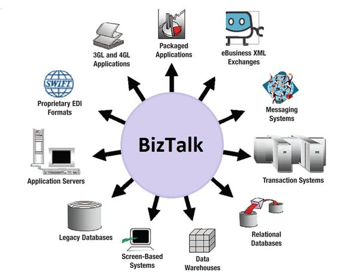

Messaging is typically used for communication across processes, also known as communication across components. It is typically used to communicate between components within a system, as opposed to integration-based communication which is often used to communicate outside of a single system.

The principles and patterns underlying queued messaging are decades old and battle-tested through countless technological shifts.

## Message systems

A message broker like RabbitMQ, Azure ServiceBus, or Amazon SQS, can be compared with a database, but instead of storing data and indexing it, it focuses on transferring data from one application to another. A client will call an API to send a message, and the API returns control to the calling thread after the message is received by the message broker.  At that point the transfer of the message across the network becomes the responsibility of the messaging technology. 

The client process is oblivious to problems that receiving clients might have; as soon as the message is sent, messaging infrastructure takes over. As a result, critical resources like threads are not held waiting for the message processing to complete. This prevents the client process from losing stability while waiting for a response from another machine or process.

Additional benefits of messaging systems:
- **Temporal decoupling:** Sender and receiver are *temporal decoupled* from each other. This means the sender and receiver execute their work independent of time. As a result there is no time availability dependency between the sender and the receiver, e.g. producer and consumer no longer need to be be running concurrently.
- **Load balancing:** Consumers can be scaled up independently from producers to handle the incoming messages on a queue.
- **Load leveling:** Producers don't need to worry about the throughput of a consumer and backpressure mechanisms as the the queue decouples the producer from the consumer.
- **Reliable communication:** Messages are safely stored on the broker, ensuring that no message will be lost in failure scenarios.

The Particular Platform offers a common set of features available to supported messaging technologies (transports), filling in missing native capabilities where needed. Building blocks like [Recoverability](/architecture/recoverability.md), [Outbox](/architecture/consistency.md#transactions-outbox-pattern), [Monitoring](/architecture/monitoring.md), etc. are available on all transports. Therefore, the choice of the best messaging technology can be simplified and focused on fundamental limitations like message size, pricing model, or portability.

## Messaging versus RPC

It's quite easy to build an application and get it working using remote procedure call (RPC) techniques like webservices (ASMX or WCF), HTTP API (ASP.NET WebAPI) or WebSockets (SignalR). However, scalability and fault-tolerance are inherently hindered when using synchronous, blocking calls. Scaling up and throwing more hardware at the problem has little effect.

Messaging makes applications loosely coupled by communicating asynchronously, which also makes the communication more reliable because the two applications do not have to be running at the same time. There are no blocking calls with asynchronous, one-way messaging. Common, transient errors can be resolved automatically with retries, and it's easy to recover from failures that require some manual intervention. Above all, even when a part of the system fails, no data gets lost.

To learn more about the relationship between messaging and reliable, scalable, and highly-available systems, watch the webinar about [handling failures with NServiceBus](https://particular.net/webinars/handling-failures-with-nservicebus) and other [webinar and presentations](https://particular.net/videos).

## Communication styles

With messaging, by nature the communication is one-way and uses the [asynchronous communication pattern](https://en.wikipedia.org/wiki/Asynchronous_method_invocation). As a result a direct response, possibly with data as a return value, is not possible with messaging.

_Asynchronous communication_ is not to be confused with _asynchronous execution_, where multiple threads execute code in parallel. The async/await concepts in .NET are an example of asynchronous execution. This is different from asynchronous communication where two components are not communicating with each other directly, but through a messaging system.

### Point-to-point channels

Point-to-point channels enable one way messaging where a component sends a message to another component via a messaging system.

Point-to-point channels can be used to send messages to a single, specific consumer. Messages sent via point-to-point channels are typically called _Commands_ as the sender requires some knowledge about the intended destination for the message and the message describes an action that sender wants the receiver to execute. Point-to-point message communication is semantically similar to asynchronous remote procedure calls. point-to-point channels can be combined:

#### Commands

Messages sent using point-to-point channels represent commands, i.e. tasks that need to be done. For example _submit order_, _cancel order_ and _update inventory_. Command messages are processed by a single receiver.

Read more about [how commands are used in NServiceBus](/nservicebus/messaging/messages-events-commands.md).

#### Request/Reply pattern

A possibility to overcome the one-way nature of messaging is using the [request/reply pattern](/nservicebus/messaging/reply-to-a-message.md). The result is two separate messages without blocking calls that are waiting for a response. NServiceBus uses information stored in the headers of a message to extract where to route the reply message to.

Request/Response is a common pattern to use in distributed systems where a system makes use of two separate occasions of one-way messaging, but to achieve the result that a component can request information from another component via messaging. Thus still being temporally decoupled from each other and still have the benefits that messaging provides.

From a network perspective, request/response is just two one-way interactions:

This communication pattern is particularly important for servers, as clients behind problematic network connections now have little effect on a server's stability. If a client crashes after sending the request, but before the server sends a response, the server will not have resources tied up waiting until the connection times out.

#### Callback pattern

Occasionally a scenario exists where the sender of a message requires a blocking call and waits for a response. Usually this occurs in existing systems where messaging is introduced and the user-interface is designed to wait for a response. Instead of an immediate and partial (but large) rewrite of the user-interface, the [callback pattern](/nservicebus/messaging/callbacks.md) can be used to wait for a response.

### Publish/Subscribe pattern

Instead of sending a message to a single and specific receiver, with the [publish/subscribe pattern](/nservicebus/messaging/publish-subscribe) the sender is logically unaware of potential receivers. Receivers can subscribe to messages at runtime, having the benefit that the sender does not need to be changed whenever a new subscriber is introduced.

In this pattern, the sender of a message is not aware if there are any subscribers neither is it aware of any subscriber its details.

Publishing a message differs sending a message using the asynchronous one-way messaging pattern, for two reasons:

1. There can be multiple receivers (subscribers)
2. The receivers don't have to be known during the design of the sender

One of the biggest benefits is that additional receivers can be added later, without modifying the sender. This means that besides temporal decoupling, the sender is also logically decoupled from any possible receiver.

Subscribers are also both temporally and logically disconnected in that they do not need to be aware of the location and the working of the publisher. The message system will take care of the subscriptions and make sure published messages will arrive at the subscriber. This is often done based on the contract.

#### Events

Messages that are published often represent events, i.e. things that have happened. For example, "order cancelled", "product went out of stock", and "shipping delayed". Sometimes an event is published after handling a command. For example, successful handling of a "cancel order" command may result in publishing an "order cancelled" event. A publisher does not have to publish an event after handling a command, but it is a common scenario.

Since many commands may be received in a short period of time, publishing an event to all subscribers for each command may saturate the system with messages, and may not be the best solution. A better solution may be to publish a single message as a result of all the commands that were handled over a given period of time. The appropriate period of time depends on the Service Level Agreement of the publisher with respect to how soon an event should be published after a given command is handled. For example, in a financial domain that may have to be as little as 10 ms, but in an e-commerce, a minute may be acceptable.

Read more about [how events are used in NServiceBus](/nservicebus/messaging/messages-events-commands.md).

## Command query separation

Many systems provide users with the ability to search, filter, sort, and change data.

In some client-server systems, a server simply exposes all CRUD (create, read, update, and delete) operations to the client. However, when the same database table is used both to perform CRUD operations in a highly consistent manner while handling commands, and to query data for users to read, those commands and queries contend with each other. This often results in poor system performance, both for commands and queries.

This problem can be avoided by separating commands and queries at the system level, above even the client and server. This solution takes advantage of the fact that in many, or even most, scenarios, the data returned to users does not have to be completely up to date; it can be slightly out of date without causing significant problems.

In this solution there are two components that each span both client and server. One component handles commands and the other responds to queries. The components communicate using only messages and their data is held separately, possibly even in separate databases, servers, or storage technologies. One component cannot access the other's data:

The command component publishes messages and the query component subscribes to them. When the query component receives a message, it stores appropriate data in a schema which is often optimized for queries, such as a star schema in a database or a cache of JSON documents. It may also cache some query responses in memory.

## Bus versus broker architectural styles 

A "service bus" is often illustrated as a central box, through which all communication goes. Despite the common understanding, that's actually a description of the **_broker architectural style_**. 

A good example is BizTalk:

A **_bus_** in the context of the **_bus architectural style_**, isn't a physical entity. There's no physical _bus_ one can point to in the network topology. The _bus_ is part of the infrastructure that is run in-process with a given application's code. It's similar to a peer-to-peer mesh that runs alongside code.

In terms of architectural style, NServiceBus is more similar to WCF than BizTalk. Just as it is possible to write a host process and activate WCF explicitly within it, the same can be done with NServiceBus. 

## Additional content

* Gregor Hohpe's [Enterprise Integration Patterns](https://www.enterpriseintegrationpatterns.com/) website and accompanying book.