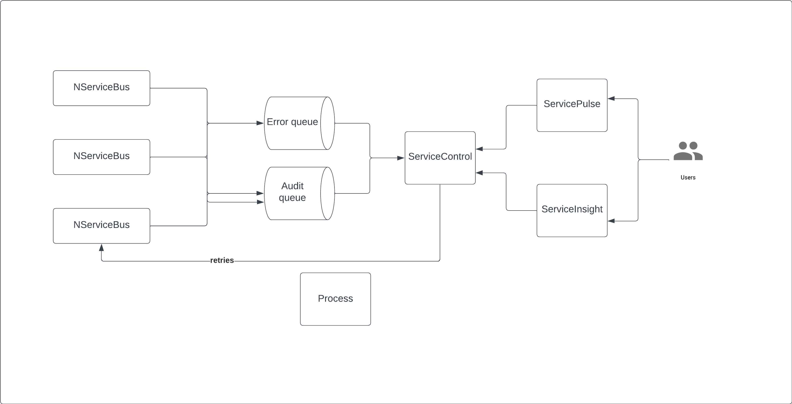

Once distributed systems are being deployed, they also need to be monitored. With many moving parts, it is often difficult to understand how the overall system currently performs, how healthy it is, and where errors occur. The Particular Platform comes with all the necessary tooling and extensions to gain insights into distributed systems in production.

## System performance

Distributed systems contain many independent processes with varying degrees of load and throughput. Understanding the overall system health requires the ability to gather and display metrics from all involved components. The choice of the right metrics is crucial to gain meaningful insights. For message-driven systems, some key metrics are:
* **Queue length** and **message throughput** to assess a components load
* **Message processing time** to understand a components time required to execute the business logic
* **Critical time** is the time from a message being sent to a queue untill it has been successfully processed

ServicePulse provides real time performance metrics with the ability to drill-down to message-level insights:

youtube: https://www.youtube.com/watch?v=is9kF7eWkrQ

[Learn more about ServicePulse performance metrics](/monitoring/metrics/in-servicepulse.md)

## System health

Failures can occur at any point throughout a distributed workflow. The following information should be monitored to determine the system health:

* **Heartbeats** can be used to quickly identify a completely failing component
* **Retries** can indicate failing components or dependencies even before the impact can affect the overall system
* **dead-lettered messages** are messages that couldn't be handled by automatic recoverability mechanism. They can indicate invalid message data, application level bugs or failing dependencies.

ServicePulse provides realtime retry metrics, heartbeats tracking, and a rich failed messages dashboard providing deep insights into the failure reasons:

## Resolving failures

Failed messages are not lost. After the failure has been identified and resolved, failed messages can be moved back to the target queue to be reprocessed and complete the business process. 

The Particular Platform Tools support various retry mechanisms, including retry functionality for whole failure groups

## Debugging and tracing

Understanding message flows related to a business process throughout a distributed system can become difficult without proper instrumentation of messages. The following approaches can be used to track message flows across a distributed system:
* Conversation ID: A unique ID generated on the first message in a distributed message-based workflow is passed along every message of the same workflow. Messages can then be correlated by the conversation ID to a specific business workflow instance, allowing tracing workflows through the whole system.
* Correlation ID: In addition to the conversation ID, the unique message ID of the preceding message can be provided to the next message receiver. This allows reconstruction of the message order and can also be used to correlate response messages back to a specific workflow state. Read more about the Correlation Identifier pattern on the [Enterprise Integration Patterns website](https://www.enterpriseintegrationpatterns.com/patterns/messaging/CorrelationIdentifier.html).

ServiceInsight provides a graphical user interfaces that can visualize message flows and provide useful metadata information for debugging purposes or to analyze complex workflows:

## Particular Platform Tools

ServiceInsight and ServicePulse are part of the Particular Platform tools. These tools pull information from ServiceControl which is the analytics backend:

## OpenTelemetry

NServiceBus also supports OpenTelemetry, enabling integration with 3rd party tooling for monitoring metrics and traces. The OpenTelemetry integration can provide:
* Basic endpoint performance metrics
* Basic endpoint failure metrics
* Message traces

[Read more about the OpenTelemetry integration](https://particular.net/blog/open-telemetry-tracing-support)

