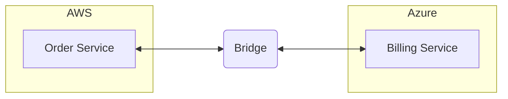
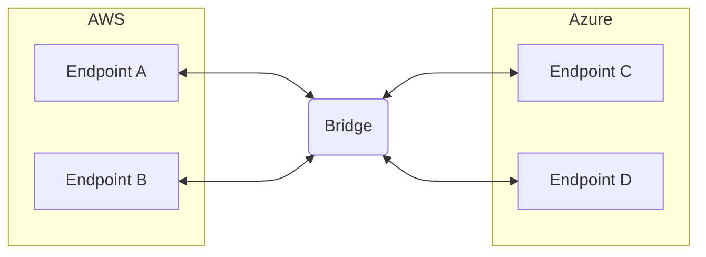
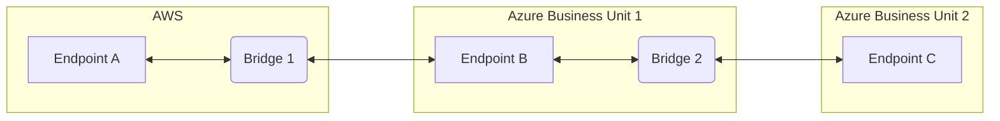
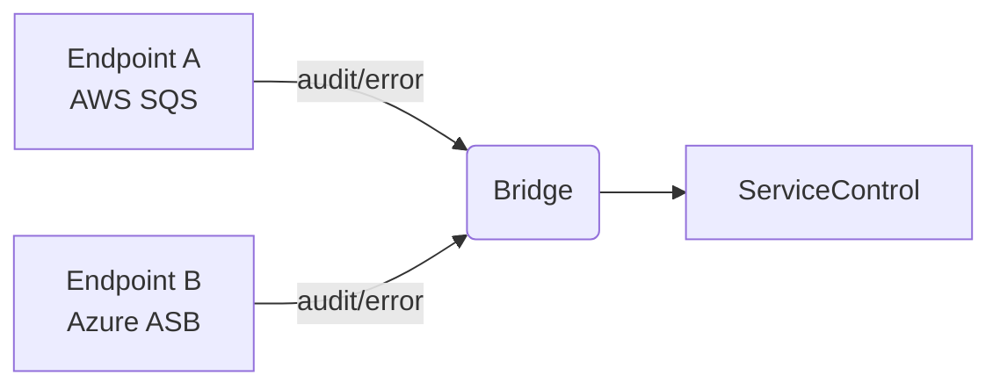

Polycloud systems use services from multiple cloud providers within a single distributed system, selecting from AWS, Azure, Google Cloud, or others based on capability, cost, compliance, or organizational requirements.

## Why polycloud

Organizations adopt polycloud strategies for several reasons:

- Distributing workloads across providers reduces dependency on any single vendor's pricing, roadmap, or availability.
- Different providers excel in different areas. A system might use Azure Service Bus for messaging while running compute workloads on AWS.
- Certain data may need to remain within a specific jurisdiction while other components can run anywhere.
- Mergers and acquisitions bring existing cloud investments that need to be integrated without a full rewrite.

## Messaging in a polycloud system

Each cloud provider offers its own native messaging infrastructure and services:

- AWS provides [Amazon SQS](/transports/sqs/), which is the recommended default for AWS-hosted endpoints
- Azure provides [Azure Service Bus](/transports/azure-service-bus/), which is the recommended default for Azure-hosted endpoints
- On-premises or cloud-agnostic environments may use [RabbitMQ](/transports/rabbitmq/), [SQL Server](/transports/sql/), or [PostgreSQL](/transports/postgresql/)

Endpoints connected to different transports cannot communicate directly. A dedicated bridge component is needed to route messages between them.

## Transport selection per cloud

Each transport is designed for its environment. The general recommendation is to use the native transport for each cloud.

### On Azure

[For Azure deployments](/architecture/azure/messaging.md), [Azure Service Bus](/transports/azure-service-bus/) is the recommended default. It supports cross-entity transactions on the Premium tier, message sizes up to 100 MB, and native publish/subscribe via topics and subscriptions.

For persistence, [Azure Cosmos DB](/persistence/cosmosdb/) is the native option for storing saga state and outbox records. See the [simple Cosmos DB sample](/samples/cosmosdb/simple/) to get started.

### On AWS

[For components hosted in AWS](/architecture/aws/messaging.md), [Amazon SQS](/transports/sqs/) is the recommended option. It is fully managed, scales automatically, and integrates with other AWS services. NServiceBus uses Amazon SNS alongside SQS to support the publish/subscribe pattern. When messages exceed the SQS size limit (256 KB for events, 1 MiB for commands), the transport can offload payloads to Amazon S3.

For persistence, [Amazon DynamoDB](/persistence/dynamodb/) stores saga state and outbox records without leaving the AWS ecosystem. See the [simple DynamoDB persistence sample](/samples/aws/dynamodb-simple/) or the [sagas with SQS and Lambda sample](/samples/aws/sagas/) to get started.

### Cloud-agnostic environments

In environments not tied to a specific cloud provider, [RabbitMQ](/transports/rabbitmq/), [PostgreSQL](/transports/postgresql/), or [SQL Server](/transports/sql/) [can be selected](/transports/selecting.md)

## Messaging Bridge

The [Messaging Bridge pattern](https://www.enterpriseintegrationpatterns.com/patterns/messaging/MessagingBridge.html) solves cross-transport communication by providing a dedicated component that transfers messages between two or more transports. The bridge is transparent to endpoints on both sides: they send and receive messages to and from logical endpoints as if no bridge were involved.

The [NServiceBus Message Bridge](/nservicebus/bridge/) is a production-ready implementation of this pattern. It supports all NServiceBus transports, making it well suited for polycloud deployments.

In the following example, endpoints running on AWS (using Amazon SQS) communicate with endpoints running on Azure (using Azure Service Bus) through a bridge:

Because message routing is handled by the bridge, endpoints on both sides require [no changes](/samples/bridge/simple/) to communicate across clouds.

## Bridge deployment options

### Two-cloud

The simplest topology connects two cloud environments with a single bridge instance. The bridge is configured with one transport on each side and routes messages between them.

### Multiple clouds

When endpoints span three or more cloud environments, multiple bridges can be chained or run in parallel. Each bridge instance connects two transports. A message originating in AWS can pass through a bridge to Azure, and from there through a second bridge to an on-premises environment.

Alternatively, a single bridge instance can be configured with more than two transports, acting as a hub that routes between all connected environments without chaining.

In other scenarios, [multiple bridge instances](/nservicebus/bridge/performance.md) can be deployed depending on the amount of traffic, each responsible for routing messages for a subset of endpoints. This distributes load without requiring all endpoints to be reconfigured.

### Bridge placement

The bridge must be reachable to the messaging infrastructure of both transports it connects. Placing the bridge in one of the cloud environments (rather than on-premises) typically minimizes latency to at least one side. For low-latency or high-volume scenarios, place the bridge in the environment that handles the most traffic.

## Observability

The Platform tools support polycloud deployments. The NServiceBus Messaging Bridge unifies observability across all clouds by capturing audit and error messages from every endpoint, giving a single view of failed messages, retries, and heartbeats regardless of where they originate.

[The bridge forwards audit and error messages](/samples/bridge/service-control/) across transport boundaries. ServicePulse then provides a unified view of all endpoints, failed messages, and message flow across the entire polycloud system.
