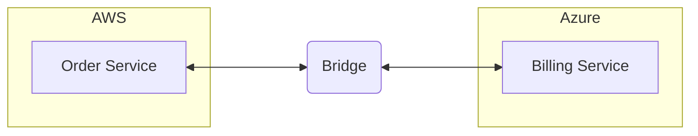
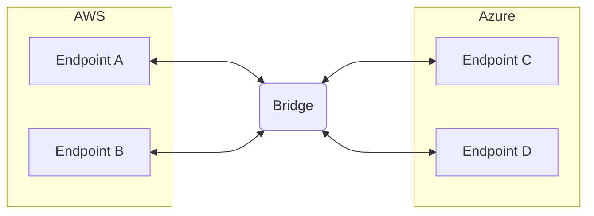
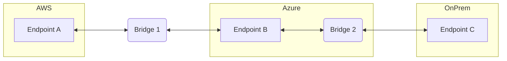
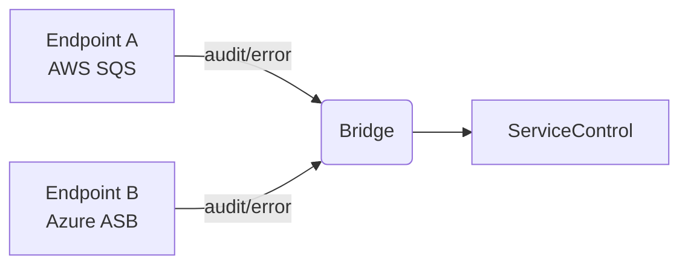

Polycloud systems use services from multiple cloud providers within a single distributed system. Rather than committing entirely to one cloud provider's ecosystem, a polycloud approach selects services from AWS, Azure, Google Cloud, or others based on capability, cost, compliance, or organizational requirements.

## Why polycloud

Organizations adopt polycloud strategies for several reasons:

- **Avoiding vendor lock-in:** Distributing workloads across providers reduces dependency on any single vendor's pricing, roadmap, or availability.
- **Best-of-breed services:** Different providers excel in different areas. A system might use Azure Service Bus for its messaging guarantees while running compute workloads on AWS.
- **Regulatory and data residency requirements:** Certain data may need to remain within a specific jurisdiction, while other components can run anywhere.
- **Mergers and acquisitions:** Teams from different organizations bring existing cloud investments that must be integrated without a full rewrite.
- **Redundancy:** Running workloads across providers reduces exposure to cloud-provider-specific outages.

## Messaging in a polycloud system

Each cloud provider offers its own native messaging transport:

- AWS provides [Amazon SQS](/transports/sqs/), which is the recommended default for AWS-hosted endpoints
- Azure provides [Azure Service Bus](/transports/azure-service-bus/), which is the recommended default for Azure-hosted endpoints
- On-premises or cloud-agnostic environments may use [RabbitMQ](/transports/rabbitmq/), [SQL Server](/transports/sql/), or [PostgreSQL](/transports/postgresql/)

Endpoints connected to different transports cannot communicate directly. A dedicated bridge component is needed to route messages between them.

## Transport selection per cloud

Each transport is designed for its environment. The general recommendation is to use the native transport for each cloud.

### AWS: Amazon SQS

Amazon SQS is the natural choice for AWS-hosted endpoints. It is fully managed, scales automatically, and integrates with other AWS services. NServiceBus uses Amazon SNS alongside SQS to support the publish/subscribe pattern. When messages exceed the SQS size limit (256 KB for events, 1 MiB for commands), the transport can offload payloads to Amazon S3.

[**Learn more about AWS messaging options →**](/architecture/aws/messaging.md)

### Azure: Azure Service Bus

Azure Service Bus is the recommended default for Azure-hosted endpoints. It supports cross-entity transactions on the Premium tier, message sizes up to 100 MB on Premium, and native publish/subscribe via topics and subscriptions. Azure Storage Queues is a lower-cost alternative for simpler workloads.

[**Learn more about Azure messaging options →**](/architecture/azure/messaging.md)

### Transport-agnostic environments

In environments not tied to a specific cloud provider, RabbitMQ is a strong option due to its native publish/subscribe support, high throughput, and broad .NET adoption. SQL Server or PostgreSQL transports are suitable when a relational database is already present and messaging volume is low.

[**Compare all supported transports →**](/transports/selecting.md)

## Messaging Bridge

The [Messaging Bridge pattern](https://www.enterpriseintegrationpatterns.com/patterns/messaging/MessagingBridge.html) solves cross-transport communication by providing a dedicated component that transfers messages between two or more transports. The bridge is transparent to endpoints on both sides: they send and receive messages to and from logical endpoints as if no bridge were involved.

The [NServiceBus Message Bridge](/nservicebus/bridge/) is a production-ready implementation of this pattern. It supports all NServiceBus transports, making it well suited for polycloud deployments.

In the following example, endpoints running on AWS (using Amazon SQS) communicate with endpoints running on Azure (using Azure Service Bus) through a bridge:

The bridge can be hosted in either cloud environment or in a neutral location. Because message routing is handled by the bridge, endpoints on both sides require no changes to communicate across clouds.

[**Read more about the NServiceBus Messaging Bridge →**](/nservicebus/bridge/)

[**Sample: Try the NServiceBus.MessageBridge sample →**](/samples/bridge/simple/)

## Bridge topology patterns

### Two-cloud bridge

The simplest topology connects two cloud environments with a single bridge instance. The bridge is configured with one transport on each side and routes messages between them.

### Three or more clouds

When endpoints span three or more cloud environments, multiple bridges can be chained or run in parallel. Each bridge instance connects two transports. A message originating in AWS can pass through a bridge to Azure, and from there through a second bridge to an on-premises environment.

Alternatively, a single bridge instance can be configured with more than two transports, acting as a hub that routes between all connected environments without chaining.

### Splitting the bridge for throughput

When message volume is high, a single bridge instance may become a bottleneck. The bridge can be split into multiple logical instances, each responsible for routing messages for a subset of endpoints. This distributes load without requiring all endpoints to be reconfigured.

[**Read more about bridge scaling →**](/nservicebus/bridge/performance.md)

## Connectivity

The bridge requires network connectivity to all cloud environments it connects. The right connectivity approach depends on security requirements, latency expectations, and the capabilities of each provider.

### Public endpoints

The simplest option is to allow the bridge to connect to each cloud's messaging service over the public internet. Most managed messaging services (Amazon SQS, Azure Service Bus) expose public HTTPS endpoints and support authentication via credentials or managed identities. This requires no VPN configuration but means traffic traverses the public internet.

### VPN and private connectivity

For environments where public routing is not acceptable, cloud providers offer private connectivity options:

- **AWS Site-to-Site VPN** and **AWS Direct Connect** connect an on-premises or external network to an AWS VPC.
- **Azure VPN Gateway** and **Azure ExpressRoute** provide the equivalent for Azure.
- **Cross-cloud VPN peering** between AWS and Azure can be established using the respective VPN gateway services on each side, routing traffic privately between the two environments.

When the bridge is deployed inside a private network, it can reach each cloud's messaging service through its respective private endpoint, keeping all message traffic off the public internet.

### Bridge placement

The bridge must be reachable to the messaging infrastructure of both transports it connects. Placing the bridge in one of the cloud environments (rather than on-premises) typically minimizes latency to at least one side. For low-latency or high-volume scenarios, place the bridge in the environment that handles the most traffic.

## Consistency

When messages are transferred across different transports, the bridge uses `ReceiveOnly` transaction mode. Unlike `TransactionScope` mode, this does not use distributed transactions spanning both brokers. As a result, in rare infrastructure failure scenarios - such as the bridge process crashing after consuming a message from one transport but before successfully delivering it to the other - a message may be delivered more than once.

There are two strategies for handling this:

### Idempotent handlers

Design message handlers so that processing the same message more than once produces the same result. For example, use the incoming message ID as a deduplication key when writing to a database, or use conditional updates that check current state before applying changes.

### Outbox pattern

The [outbox pattern](/architecture/consistency.md) records processed message IDs in the same database transaction as the business operation. If the same message arrives again, the outbox detects that it has already been processed and suppresses reprocessing. This is the recommended approach when handlers cannot be made naturally idempotent.

[**Read more about the outbox pattern →**](/nservicebus/outbox/)

> [!NOTE]
> If all configured transports support the `TransactionScope` transaction mode, the bridge uses distributed transactions and duplicate delivery is not a concern. This applies when both sides use transports such as SQL Server with MSDTC support.

## Observability

In a system that spans multiple transports, each transport would normally require its own ServiceControl instance. This creates fragmented visibility: failed messages, retries, and heartbeats are spread across multiple monitoring installations.

The NServiceBus Messaging Bridge can consolidate observability by routing audit and error messages from all endpoints to a single ServiceControl instance, regardless of which transport each endpoint uses.

In this configuration, the bridge is configured to forward audit and error messages across transport boundaries. ServicePulse and ServiceInsight can then provide a unified view of all endpoints, failed messages, and message flow across the entire polycloud system.

[**Sample: Using the Bridge to connect to a single ServiceControl →**](/samples/bridge/service-control/)

[**Learn more about ServiceControl →**](/servicecontrol/)

## Hosting the bridge

### Dedicated process

The bridge should run in a dedicated hosting process, separate from any regular NServiceBus endpoints. The bridge is purely infrastructural: it has no business logic and its resource characteristics (CPU, memory, network) differ significantly from a typical endpoint. Mixing the bridge with business endpoints makes it harder to scale and monitor each independently.

### Scaling out

The bridge can be scaled horizontally by deploying multiple instances with the same configuration, provided both connected transports are broker-based (which includes Amazon SQS, Azure Service Bus, RabbitMQ, SQL Server, and PostgreSQL). Multiple bridge instances compete to process messages from the source transport queue. Each message is processed by exactly one instance.

MSMQ is a federated transport and does not support competing consumers, so horizontal scale-out is not possible when MSMQ is one of the connected transports.

### Resource characteristics

The bridge's performance is driven primarily by infrastructure: CPU for message processing, network bandwidth between the two transports, and disk where applicable. This makes capacity planning more predictable than for business endpoints, which are affected by external dependencies like databases and third-party APIs.

[**Read more about bridge performance and scaling →**](/nservicebus/bridge/performance.md)
