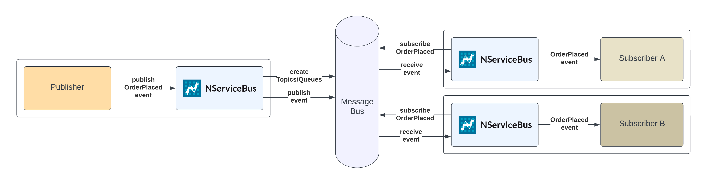

Business processes typically involve various distributed components that need to be invoked in a coordinated manner. The Particular Service Platform supports both choreography and orchestration of workflows.

> [!NOTE]
> Choreography and orchestration are not mutually exclusive. The patterns may be combined at different levels of business workflows.

## Choreography

Choreographed workflows are implemented by an implicit flow of events between services instead of a central owner of a process. Services are highly decoupled by the use of [publish/subscribe](/architecture/messaging.md#communication-styles-publishsubscribe-pattern). Published messages are called _events_ because they describe a fact about something that happened to the rest of the system. Subscribers react to events as required. There is no central state of the workflow.

_A choreographed event-driven workflow across multiple endpoints, visualized by a [ServiceInsight sequence diagram](/serviceinsight/sequence-diagram)._

### Implementing choreographed workflows

NServiceBus provides a simple [publish/subscribe](/nservicebus/messaging/publish-subscribe/publish-handle-event.md) API for all supported messaging technologies. NServiceBus can automatically create and manage the necessary infrastructure, like topics, subscriptions, and queues.

[**Sample: Publish/Subscribe with NServiceBus →**](/samples/pubsub/native/)

### Challenges

* When implementing complex workflows, messages flowing through the system can quickly become difficult to understand and track. To have a full picture of the message flow, the implementation of every service needs to be known. The absence of a central processor requires more effort to detect failed or stuck business processes. [Particular Service Platform monitoring](/monitoring/) helps to understand and monitor complex choreographed workflows.
* Putting too much data on events will quickly reintroduce coupling and impact overall system performance. Read more about properly sizing event messages in the blog post on [putting events on a diet](https://particular.net/blog/putting-your-events-on-a-diet).
* Complex workflows that require aggregation of multiple events require local state. Service-internal [orchestration using NServiceBus sagas](#orchestration) can be used to easily aggregate multiple events and process timeouts in a component of a choreographed workflow.
* Maintaining a consistent state across all choreography participants in case of failures can become challenging as the coordination and flow of compensating events can quickly multiply the complexity of a choreographed workflow. Choreography is best used for processes that tolerate eventual consistency. [Orchestrated workflows](#orchestration) may be better for processes that require more consistency.

## Orchestration

Orchestrated workflows are managed by a central process that instructs components to perform work in a specific order, manages state, and handles failures. Orchestration can be useful in complex workflows that contain multiple conditions or time-based triggers or have stronger consistency requirements. Instead of events, message-based orchestration relies on `commands` that the orchestrator sends to receivers that handle them.

### Implementing orchestrated workflows

NServiceBus is designed to handle long-running business processes in a robust and scalable way using the [saga feature](/nservicebus/sagas/). NServiceBus sagas are a convenient programming model to implement orchestrated, long-running business workflows or state machines using regular C# (or any other .NET language). Sagas handle recoverability, shared state, message correlation, timeouts, and more.

_An orchestrated workflow implemented as an NServiceBus Saga, visualized by [ServiceInsight](/serviceinsight)._

[**Tutorial: Introduction to NServiceBus sagas →**](/tutorials/nservicebus-sagas/1-saga-basics/)

> [!NOTE]
> NServiceBus sagas focus on providing a convenient and efficient way to manage message-based workflows as described by the [Process Manager pattern](https://www.enterpriseintegrationpatterns.com/patterns/messaging/ProcessManager.html). The [_saga distributed transactions_ pattern](https://learn.microsoft.com/en-us/azure/architecture/reference-architectures/saga/saga) is primarily concerned with managing long-lived transactions and ensuring consistency between multiple operations, especially in the presence of failures. The NServiceBus saga feature can be used to implement the _saga distributed transactions_ pattern.

### Challenges

* Orchestrators have much higher coupling due to the dependency on the components that are being orchestrated for the workflow. This makes it likely that orchestrators need to change when those components change. Additionally, the orchestrator may require data from those components, further increasing coupling. Orchestration can be a good choice for technical processes within a bounded context, whereas [choreography](#choreography) is often a better approach for processes involving more than one bounded context.
* Orchestrators are more difficult to scale because all workflow communication has to go through the central orchestrator, introducing a potential bottleneck. NServiceBus sagas follow performance best practices to optimize integration with all supported data stores for state storage.
