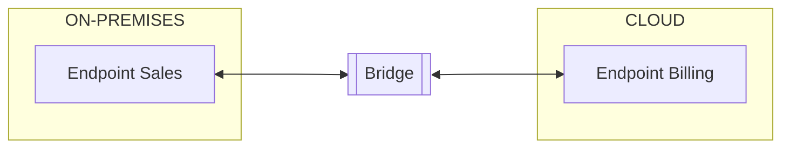

Moving on-premises systems to the cloud allows them to benefit from [the advantages](https://docs.aws.amazon.com/whitepapers/latest/aws-overview/six-advantages-of-cloud-computing.html) offered by cloud computing.

NServiceBus supports queuing technologies provided by cloud providers like AWS and Azure, so any on-premise NServiceBus endpoints can be migrated to the cloud. The following migration guides provide more details on specific cloud providers:

- [Migrating from on-premises to Microsoft Azure](/modernization/migrate-to-the-cloud/on-premises-to-azure.md)
- [Migrating from on-premises to AWS](/modernization/migrate-to-the-cloud/on-premises-to-aws.md)

## Migrating

By the time an on-premises system is considered for migration to the cloud, it has likely grown large enough that migrating everything at once would be a risky and intensive effort.

To mitigate this, migrating parts of the system to the cloud can be done by identifying, extracting, and moving one piece at a time. New services may also be built during the migration process.

The resulting [hybrid system](/architecture/hybrid-systems.md) requires that on-premises and cloud systems be able to communicate, but allows for a safer and more deliberate migration.

### Hybrid system communication

Queueing technologies do not inherently communicate with each other. As on-premises systems begin moving to the cloud or new services are added, communication from on-premises to cloud technologies becomes essential.

The [NServiceBus Messaging Bridge](/nservicebus/bridge) acts as a connector, allowing on-premises endpoints to exchange messages seamlessly and reliably with those in the cloud.

## Useful links

- [Legacy Architecture Modernisation With Strategic Domain-Driven Design](https://medium.com/nick-tune-tech-strategy-blog/legacy-architecture-modernisation-with-strategic-domain-driven-design-3e7c05bb383f)
- [Modernization Strategy Selector](https://medium.com/nick-tune-tech-strategy-blog/modernization-strategy-selector-e06eb722dee)
- [NServiceBus Quickstart guide](/tutorials/quickstart/)
- [What they don't tell you about migrating a message-based system to the cloud](https://particular.net/blog/messaging-bridge-migrating-to-the-cloud)
