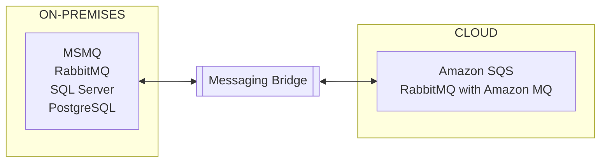

## Overview

[AWS Application Migration Service](https://aws.amazon.com/application-migration-service/when-to-choose-aws-mgn/) is an option for getting on-premises systems into the cloud quickly.

Amazon Simple Queue Service ([Amazon SQS](https://aws.amazon.com/sqs/)) is a fully managed cloud-based queueing service supported by the [NServiceBus Amazon SQS Transport](/transports/sqs).

[Amazon MQ](https://aws.amazon.com/amazon-mq/) supports [RabbitMQ brokers](https://docs.aws.amazon.com/amazon-mq/latest/developer-guide/working-with-rabbitmq.html) which can be used with the [NServiceBus RabbitMQ transport](/transports/rabbitmq/).

The [NServiceBus Messaging Bridge](/nservicebus/bridge) acts as a connector, enabling seamless and reliable message exchange between on-premises endpoints and those using AWS-native transports. This allows you to migrate endpoints to AWS gradually, without disrupting existing operations.

## AWS supported transports

- [Amazon SQS](/transports/sqs/)
- [RabbitMQ](/transports/rabbitmq/) with [Amazon MQ](https://aws.amazon.com/amazon-mq/)
- [SQL Server](/transports/sql/)  using [Amazon RDS for SQL Server](https://aws.amazon.com/rds/sqlserver/)
- [PostgreSQL](/transports/postgresql/)  using [Amazon RDS for PostgreSQL](https://aws.amazon.com/rds/postgresql/) or [Amazon Aurora](https://aws.amazon.com/rds/aurora/)

> [!NOTE]
> While SQL transports are supported, it is not recommended to migrate *to* them, as dedicated queueing technologies are more efficient.

## On premise transports

- [MSMQ](/transports/msmq/)
- [RabbitMQ](/transports/rabbitmq/)
- [SQL Server](/transports/sql/)
- [PostgreSQL](/transports/postgresql/)
