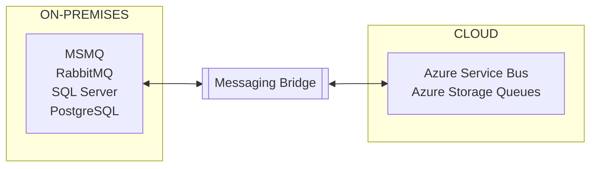

## Overview

[Azure Migrate](https://azure.microsoft.com/en-us/products/azure-migrate) is an option for getting on-premises systems into the cloud quickly.

It provides a centralized hub to assess and migrate on-premises systems to the Azure cloud. It supports a range of migration scenarios, including virtual machines, databases, and applications.

Azure Service Bus and Azure Storage Queues are fully managed messaging services supported by NServiceBus. For systems using SQL Server transport, Azure SQL Database or SQL Server on Azure Virtual Machines offer cloud-hosted alternatives that maintain compatibility with NServiceBus transports.

The [NServiceBus Messaging Bridge](/nservicebus/bridge) acts as a connector between on-premises endpoints and those using Azure-native transports. It enables a phased migration approach to minimize risk by allowing incremental migration, service-by-service, while ensuring the system remains fully functional throughout the transition.

## Azure supported transports

- [Azure Service Bus](/transports/azure-service-bus/)
- [Azure Storage Queues](/transports/azure-storage-queues/)
- [SQL Server](/transports/sql/)  using [Azure SQL Database](https://azure.microsoft.com/en-us/products/azure-sql/database/) or [SQL Server on Azure VM](https://azure.microsoft.com/en-us/products/virtual-machines/sql-server/)
- [PostgreSQL](/transports/postgresql/) using [Azure Database for PostgreSQL](https://azure.microsoft.com/en-us/products/postgresql/)

> [!NOTE]
> While SQL transports are supported, it is not recommended to migrate *to* them, as dedicated queueing technologies are more efficient.

## On premise transports

- [MSMQ](/transports/msmq/)
- [RabbitMQ](/transports/rabbitmq/)
- [SQL Server](/transports/sql/)
- [PostgreSQL](/transports/postgresql/)
