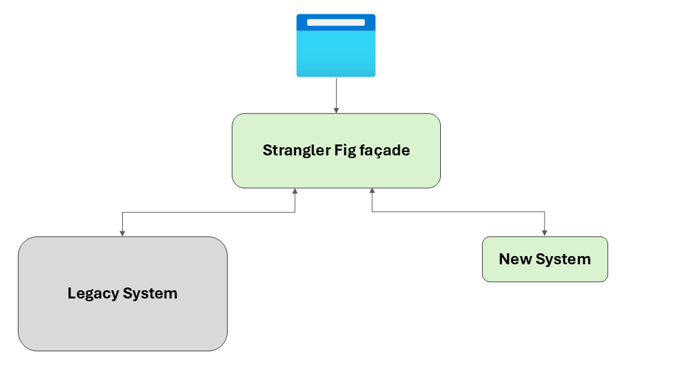
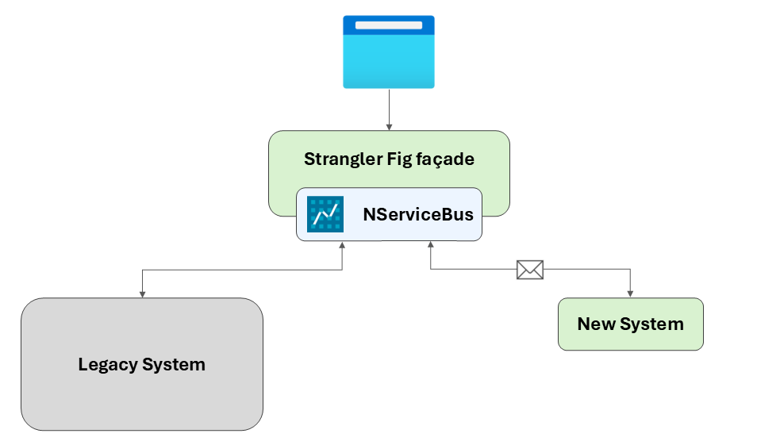
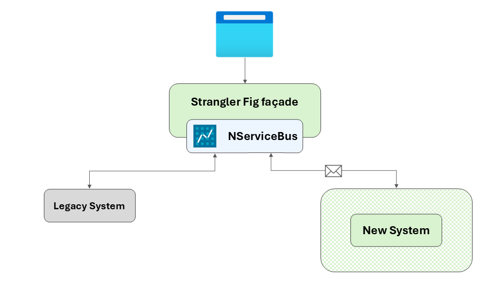
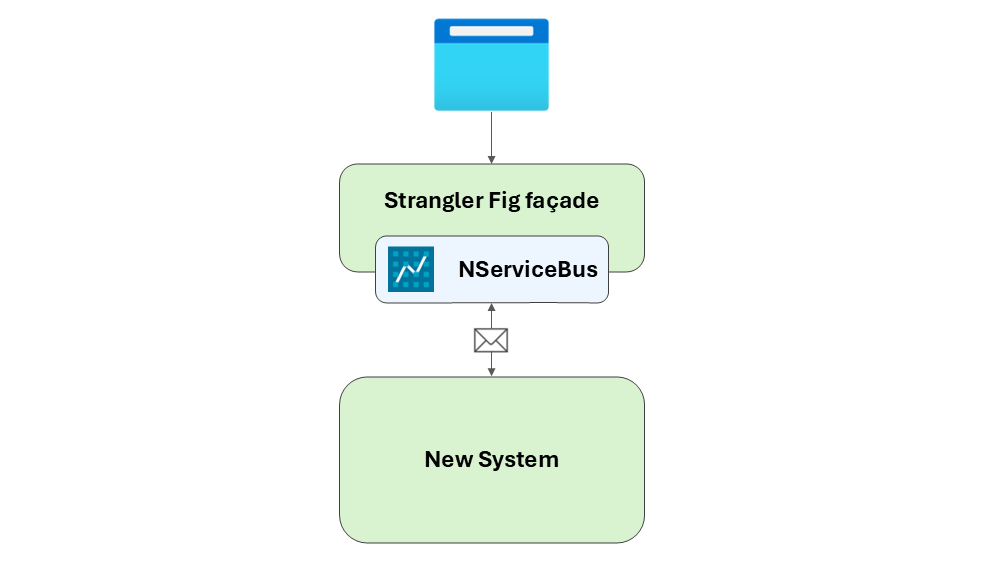

For teams maintaining legacy .NET systems, modernization can feel daunting. Rewrites are risky, and big-bang migrations rarely go to plan. An alternative approach involves introducing the [Particular Platform](/platform) into a legacy environment using the [Strangler Fig pattern](https://learn.microsoft.com/en-us/azure/architecture/patterns/strangler-fig).

## Establishing the façade

The process begins by placing an API façade between the frontend and the existing backend. For example, the backend might be an [ASP.NET](http://asp.net/) MVC application running on .NET Framework 4.8, with a frontend built using Angular.js or Knockout.js. The frontend remains unchanged at this stage. The façade is developed in modern .NET (currently .NET 9) and becomes the new single entry point into the system.

At this stage, the system still functions as a tightly coupled monolith. Introducing the façade provides a clean boundary, enabling evolution without disrupting the client or core business operations.

## Introducing the Particular Service Platform

The next step involves integrating the Particular Service Platform into the façade. At the heart of the platform is NServiceBus, which enables reliable message-based communication between endpoints. Messages—simple C# classes—are sent between endpoints to trigger actions, model workflows, or propagate events. The façade can now publish or send messages without migrating any underlying functionality.

In cases where legacy clients expect synchronous request/response behavior, [NServiceBus client-side callbacks](/nservicebus/messaging/callbacks.md) can be used to support gradual adoption of messaging while maintaining compatibility.

### Platform capabilities and initial benefits

By introducing the Particular Service Platform at the API façade level, the system gains several operational benefits immediately—even before any business functionality is migrated:

- **Reliability & resilience**: Messages are durably stored, automatically retried on failure, and protected from data loss. The system can recover from transient failures without manual intervention.
- **Observability & diagnostics**: ServicePulse and ServiceInsight offer out-of-the-box observability tools. ServicePulse enables near real-time monitoring and recovery operations (such as retrying failed messages), while ServiceInsight provides rich visualizations, message flows, and debugging insights for developers. These tools provide visibility into system behavior often absent from legacy applications.
- **Backpressure & decoupling**: Queues absorb spikes in load, and messaging decouples producers and consumers, reducing direct dependencies on the legacy system.
- **Error handling**: Failed messages are routed to an error queue and can be retried once the issue is resolved. While this does not eliminate failures in the legacy app, it improves transparency and recovery.
- **Operational safety**: New logic can be introduced into the façade or new services with reduced risk, enabling safer, incremental delivery.

Even without migrating a single feature, this architectural shift introduces durable messaging, diagnostics, and built-in failure recovery. These capabilities establish a foundation for safe, confident evolution over time.

## Migrating functionality

With messaging in place, new components can take on specific responsibilities outside the legacy system and evolve independently as needed. Whether the target architecture is a monolith, modular monolith, microservices-based system, or something in between, the messaging foundation supports a range of styles without prescribing a specific direction. The legacy system continues to support remaining responsibilities, but boundaries are now clearly defined.

> [!NOTE]
> **Don’t forget your batch jobs**  
> Legacy systems often rely on scheduled batch jobs for critical business operations, but these are often brittle and opaque. As you modernize, consider replacing them with message-driven handlers to improve reliability, visibility, and alignment with an asynchronous architecture. See [*Death to the Batch Job*](https://particular.net/blog/death-to-the-batch-job/) for more.

### Intermediate benefits

As business logic moves into new services, the benefits compound:

- **Performance & scalability**: Individual workloads such as order processing or billing can scale independently. Asynchronous messaging avoids blocking client requests.
- **Autonomous services**: Services become independently deployable units, versioned and tested in isolation.
- **System evolution**: New services are built using modern frameworks and hosting models (e.g., .NET 9, containers), without requiring upgrades to the legacy stack.
- **Cleaner boundaries**: Messaging introduces explicit contracts between services, clarifying responsibilities and dependencies.
- **Safer experimentation**: New features can be released gradually using feature flags or by running new implementations in parallel (e.g., shadow reads).

## Fully modernized system

Over time, more features move into independently hosted services, and eventually the legacy backend is retired.

The client remains unaware of internal changes, while the system becomes progressively more modular, observable, and resilient. At this point, the legacy backend has been fully decommissioned, and all functionality is handled by a modern, message-driven system.

The API façade may then be removed entirely, especially if no longer required for routing or compatibility with the legacy system. Alternatively, it may be retained as an API gateway to provide a centralized entry point for cross-cutting concerns such as authentication, authorization, request throttling, logging, versioning, or telemetry. Whether the façade is removed or evolves into an API gateway depends on specific system requirements and architectural direction.

---

### Additional resources

For more information, see the following resources:

- [Strangler Fig Pattern](https://learn.microsoft.com/en-us/azure/architecture/patterns/strangler-fig)
- [Particular Platform Overview](/platform)
- [NServiceBus Documentation](/nservicebus)
- [ServicePulse Documentation](/servicepulse)
