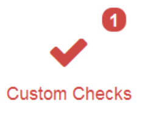
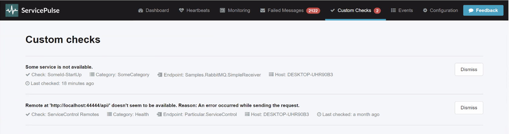

ServicePulse monitors the health and activity of an NServiceBus endpoint using [Heartbeats](/monitoring/heartbeats/) and [Custom Checks](/monitoring/custom-checks/).

The main dashboard shows a custom checks icon which will indicate if there are any failing custom checks.

IMAGE: Main Dashboard with custom checks icon showing red with 2 or 3 failing custom checks. 

Click this icon to go to the custom checks details page. This page shows a list of all custom checks and their current status.

Each custom check includes information about the endpoint instance that reported the status and how long ago the status was updated.

## Muting custom checks

When a custom check fails it will continue to make the main Custom Checks badge on the dashboard red until the custom check reports success. 

Sometimes a custom check reports an error that is easily solved. The status of the custom check will not be updated in ServicePulse until the custom check is executed again. 

If it is a one-off custom check, then the endpoint hosting it will need to be restarted in order to execute the custom check again. If it is a periodic custom check, then it will be automatically executed again after it's scheduled period. 

Rather than wait for the failing custom check to be executed again to update it's status, it can be muted. Muted custom checks are removed from ServicePulse and will not contribute to the main custom checks dashboard badge. 

Whenever a muted custom check is executed and reports it's status to ServiceControl, it is automatically un-muted.