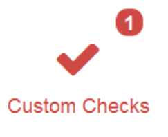
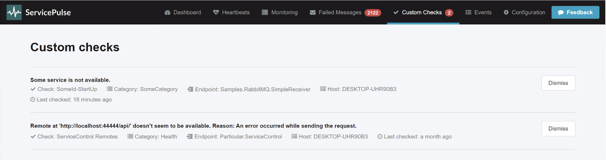

ServicePulse monitors the health and activity of an NServiceBus endpoint using [Heartbeats](/monitoring/heartbeats/) and [Custom Checks](/monitoring/custom-checks/).

The main dashboard shows a custom checks icon that indicates whether there are any failing custom checks.

Click this icon to go to the custom checks details page. This page lists all custom checks and their current status.

Each custom check includes information about the endpoint instance that reported the status and how long ago the status was last updated.

## Muting custom checks

When a custom check fails, the main Custom Checks badge on the dashboard will remain red until the custom check reports success.

Sometimes a custom check reports an easy-to-solve error; however, the custom check's status will not be updated in ServicePulse until it is executed again. If it is a one-off custom check, the endpoint hosting the check will need to be restarted to execute it again. If it is a periodic custom check, it will be automatically rerun after the scheduled interval.

Rather than waiting for the failing custom check to run again to update its status, the check can be muted. Muted custom checks have been removed from ServicePulse and will no longer contribute to the main custom checks dashboard badge.

Whenever a muted custom check is executed and reports its status to ServiceControl, it is automatically unmuted.
