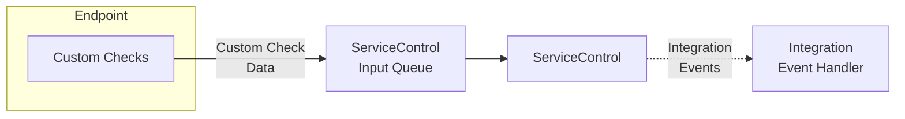

The Custom Checks plugin enables endpoint health monitoring by running custom code and reporting status (success or failure) to a ServiceControl instance.

## Set up Custom Checks

To enable custom checks in an environment:

1. [Install a ServiceControl instance](/servicecontrol/servicecontrol-instances/)
2. [Install the Custom Checks plugin in endpoints that will contain custom checks](install-plugin.md) and [write a custom check](writing-custom-checks.md)
3. [View the status of Custom Checks in ServicePulse](in-servicepulse.md)
4. Optionally [subscribe to integration events from ServiceControl when custom checks succeed or fail](notification-events.md)

## Common scenarios for Custom Checks

While the specific needs and dependencies of solutions and endpoints may vary significantly, there are common scenarios of required external conditions and services.

### Connectivity

Most endpoints require connectivity to local intranet or external internet. Some also require VPN connectivity.

It is recommended that to periodically check that the endpoint (and its host) can indeed connect to the resources it requires.

#### Examples:

- In a store & forward pattern (MSMQ): can an endpoint hosted on one machine connect to another machine, on which another endpoint is located ?
- In a broker pattern: can the endpoint connect to the broker (e.g., SQL Server)?
- If required by the endpoint, can the endpoint connect to the local intranet?
- If required by the endpoint, can the endpoint connect to the internet?
- If required by the endpoint, can the endpoint connect with the required security settings, credentials, and VPN software?

### Storage

- When local or remote storage is required by the endpoint, is that storage location available, accessible, and properly configured (security, permissions, quota, etc.)?
- When local or remote storage is required by the endpoint, is there enough available storage left for required operations? If there is a requirement for a minimum free space available, is that requirement met?

### External Services

- When an endpoint needs to communicate with external services (credit card validation, identity and authentication service, CRM, etc.), is that service available, accessible, and responsive?