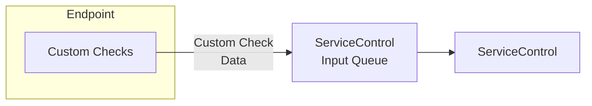

The Custom Checks plugin enables endpoint health monitoring by running custom code and reporting status (success or failure) to a ServiceControl instance.

To enable custom checks in an environment:

1. [Install a ServiceControl instance](/servicecontrol/servicecontrol-instances/)
2. [Install the Custom Checks plugin in endpoints that will contain custom checks](install-plugin.md) and [write a custom check]()
3. [View the status of Custom Checks in ServicePulse](heartbeats-in-servicepulse.md)
4. Optionally [subscribe to integration events from ServiceControl when custom checks succeed or fail](notification-events.md)

