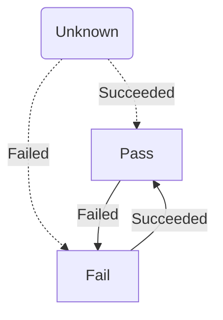

ServiceControl exposes two integration events related to the Custom Checks plugin.

For information about how to subscribe to ServiceControl integration events, see [Using ServiceControl events](/servicecontrol/contracts.md).

Each custom check begins in an unknown state. Once the custom checks executes and reports its status to ServiceControl the custom check will transition to a pass or fail status. External integration events are raised whenever the custom checks transitions into a new state.




## `CustomCheckFailed`

The `CustomCheckFailed` event is published if a custom check transitions from the unknown or pass state to the fail state.

```csharp
public class CustomCheckFailed
{
    /// <summary>
    /// The id for the custom check provided by the user.
    /// </summary>
    public string CustomCheckId { get; set; }

    /// <summary>
    /// The custom check category provided by the user.
    /// </summary>
    public string Category { get; set; }

    /// <summary>
    /// The reason provided by the user for the failure.
    /// </summary>
    public string FailureReason { get; set; }

    /// <summary>
    /// The date and time the check failed.
    /// </summary>
    public DateTime FailedAt { get; set; }

    /// <summary>
    /// The name of the endpoint
    /// </summary>
    public string EndpointName { get; set; }

    /// <summary>
    /// The unique identifier for the host that runs the endpoint
    /// </summary>
    public Guid HostId { get; set; }

    /// <summary>
    /// The name of the host
    /// </summary>
    public string Host { get; set; }
}
```


## `CustomCheckSucceeded`

The `CustomCheckSucceeded` event is published if a custom check transitions from the unknown or fail state to the pass state.

```csharp
public class CustomCheckSucceeded
{
    /// <summary>
    /// The id for the custom check provided by the user.
    /// </summary>
    public string CustomCheckId { get; set; }

    /// <summary>
    /// The custom check category provided by the user.
    /// </summary>
    public string Category { get; set; }

    /// <summary>
    /// The date and time the check passed.
    /// </summary>
    public DateTime SucceededAt { get; set; }

    /// <summary>
    /// The name of the endpoint
    /// </summary>
    public string EndpointName { get; set; }

    /// <summary>
    /// The unique identifier for the host that runs the endpoint
    /// </summary>
    public Guid HostId { get; set; }

    /// <summary>
    /// The name of the host
    /// </summary>
    public string Host { get; set; }
}
```
