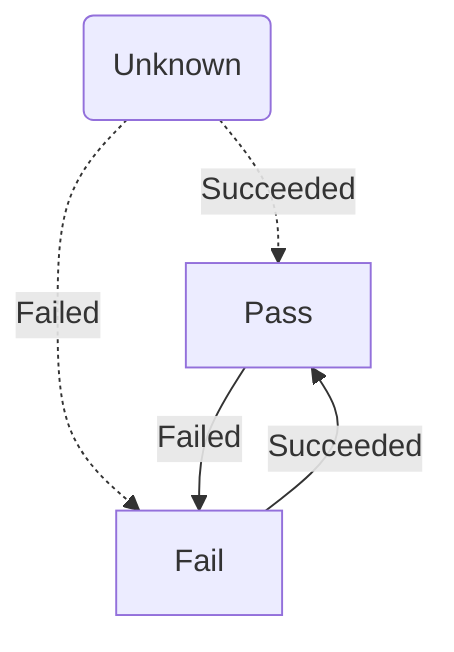

ServiceControl exposes two integration events related to the Custom Checks plugin.

For information about how to subscribe to ServiceControl integration events, see [Using ServiceControl events](/servicecontrol/contracts.md).

Each custom check begins in an unknown state. Once the custom checks executes and reports it's status to ServiceControl the custom check will transition to Pass or Fail status. External integration events are raised whenever the custom checks transitions in to a new state.

## `CustomCheckFailed`

The `CustomCheckFailed` event is published if a custom check transitions from the unknown or pass state to the fail state.

TODO: Put a sample of the event in here 

## `CustomCheckSucceeded`

The `CustomCheckSucceeded` event is published if a custom check transitions from the unknown or fail state to the pass state.

TODO: Put a sample of the event in here