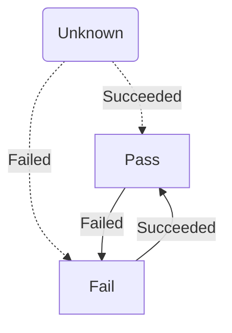

ServiceControl exposes two integration events related to the Custom Checks plugin.

For information about how to subscribe to ServiceControl integration events, see [Using ServiceControl events](/servicecontrol/contracts.md).

Each custom check begins in an unknown state. Once the custom checks executes and reports its status to ServiceControl the custom check will transition to a pass or fail status. External integration events are raised whenever custom checks transition into new states.

## `CustomCheckFailed`

The `CustomCheckFailed` event is published if a custom check transitions from the unknown or pass state to the fail state.

snippet: CustomCheckFailed

## `CustomCheckSucceeded`

The `CustomCheckSucceeded` event is published if a custom check transitions from the unknown or fail state to the pass state.

snippet: CustomCheckSucceeded