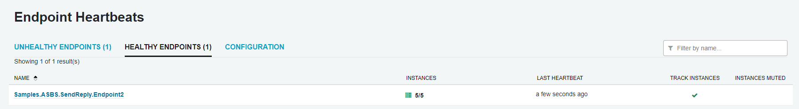
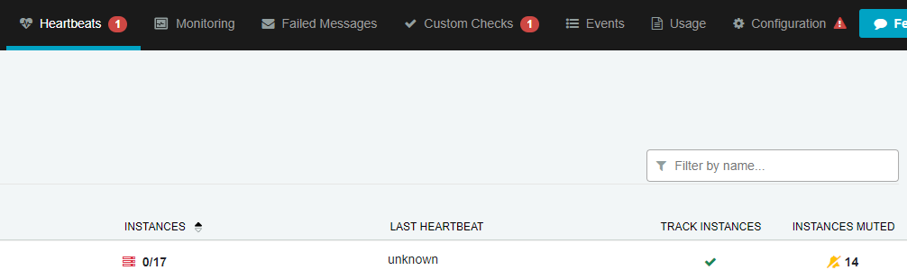
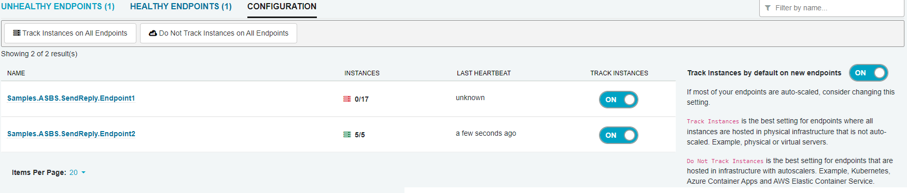
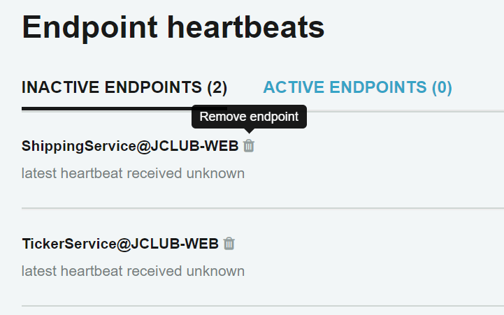

ServicePulse relies on heartbeat messages sent from the heartbeat plugin to indicate whether an endpoint is active or inactive. The main dashboard shows a heartbeat icon which will indicate if there are any inactive endpoints.

Click this icon to go to the endpoints overview. This page shows a list of active and inactive endpoint instances. Each endpoint instance shows when the most recent heartbeat from that instance was received.

The list of endpoints can be sorted or filtered using the sort dropdown and the filter textbox on the right side of the page.

## Hiding endpoints

By default, each new endpoint discovered by ServicePulse is monitored for heartbeats. If the endpoint is not sending heartbeats (either because it is offline or because it does not have the heartbeats plugin installed) it will immediately be marked as inactive.

Heartbeat monitoring for endpoint instances can be configured in the configuration tab of the Heartbeats page.

Setting the endpoint to "Off" will prevent it from appearing on the endpoints overview screen and from affecting the dashboard.

NOTE: This is a configuration setting only and the endpoint itself may still be configured to send heartbeat messages.

## Removing endpoints 

When an endpoint has been decommissioned and should no longer be displayed in ServicePulse it can be removed. From the Endpoint Heartbeats screen, click the trash bin icon next to an endpoint's name to remove it from ServicePulse.

NOTE: This feature requires ServicePulse version 1.23 or higher and ServiceControl version 4.4 or higher.

