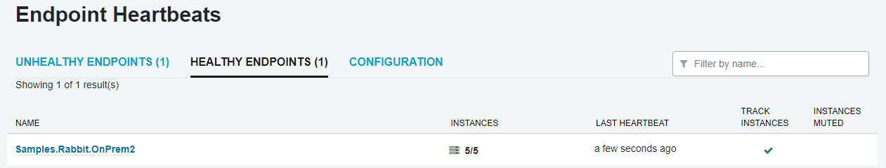
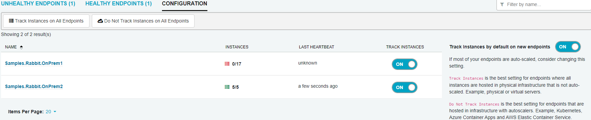
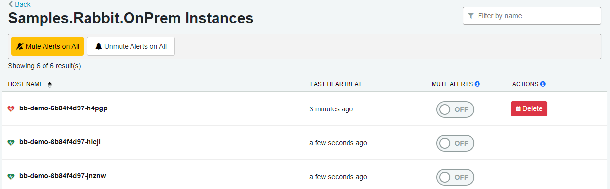

ServicePulse relies on heartbeat messages sent from the heartbeat plugin to indicate whether an endpoint is healthy or unhealthy. The main dashboard shows a heartbeat icon which will indicate if there are any unhealthy endpoints.

Click this icon to go to the endpoints overview. This page shows a list of healthy and unhealthy [logical endpoints](/nservicebus/endpoints/#logical-endpoints). Each endpoint shows the number of [instances](/nservicebus/endpoints/#endpoint-instance) associated with that endpoint, when the most recent heartbeat from any instance of that endpoint was received, whether the endpoint [tracks instances or not](#configuration-track-instances), and whether any instances associated with the endpoint have their [alerts muted](#instances-muting-instances).

The list of endpoints can be sorted by any column, or filtered using the filter textbox on the right side of the page.

- **NAME**: The logical name of the endpoint. Clicking this value will navigate to a page displaying the [instances](#instances) associated with this endpoint
- **INSTANCES**: An indication of the number of instances detected for this endpoint. The icon displayed is color coded: green for all instances alive, yellow for some instances alive and red for no instances alive.
  - For [Track Instances](#configuration-track-instances) endpoints, this will display `number of alive instances`/`total number of known instances`
  - For [Do Not Track Instances](#configuration-do-not-track-instances) endpoints, this will display the current number of alive instances
- **LAST HEARTBEAT**: Approximate time the last heartbeat for any instance was received.
- **TRACK INSTANCES**: A checkmark is displayed if this endpoint is set to [Track Instances](#configuration-track-instances)
- **INSTANCES MUTED**: An indication of the number of instances that have had their heartbeat [alerts muted](#instances-muting-instances). The icon displayed is color coded: yellow for some instances muted and red for all instances muted.

## Configuration

The configuration tab allows for configuring the Track/Do Not Track Instances status of each endpoint, as well as setting the default for any new logical endpoints that come online.

There are bulk operation buttons at the top of the tab to allow for setting the Track/Do Not Track Instances status of all endpoints at once.

> [!NOTE]
> This feature requires ServicePulse version 1.42.0 or higher and ServiceControl version 5.9.0 or higher.

### Track Instances

`Track Instances` is the best setting for endpoints where all instances are hosted in physical infrastructure that is not auto-scaled. For example, physical or virtual servers. All current and historical instances will be tracked, unless the instance is [deleted](#instances-removing-endpoint-instances). If any instances are not receiving heartbeats, or if any instances have been muted, then the endpoint is marked as unhealthy.

### Do Not Track Instances

`Do Not Track Instances` is the best setting for endpoints that are hosted in infrastructure with autoscalers. For example, Kubernetes, Azure Container Apps and AWS Elastic Container Service. Historical instances are not tracked, and only currently alive instances will be shown. The endpoint will be marked as unhealthy if there are no alive instances, and will be automatically removed after 6 hours of inactivity.

## Instances

Each logical endpoint has one or many physical or virtual instances that perform the actual work of handling or sending messages.

### Muting Instances

By default, each new endpoint instance discovered by ServicePulse is monitored for heartbeats. If the instance is not sending heartbeats (either because it is offline or because it does not have the heartbeats plugin installed) it will immediately be marked as unhealthy and an alert will show in the navigation and on the dashboard. If this is not desired, E.g. if the instance is intentionally offline for maintenance or redeployment, then the instance can be muted which will prevent alerts from being shown. The endpoint will still be marked as unhealthy, as a reminder to unmute once maintenance is complete.

There are bulk operation buttons at the top of the screen to allow for muting or unmuting all instances of an endpoint at once.

### Removing Endpoint Instances

When an endpoint instance has been decommissioned, and should no longer be displayed in ServicePulse, it can be removed.
- For [Tracked Instances](#configuration-track-instances), click the `Delete` button on the instance row to remove it from ServicePulse
- For [Untracked Instances](#configuration-do-not-track-instances), the endpoint instance will automatically be removed after 6 hours of inactivity.

> [!NOTE]
> This feature requires ServicePulse version 1.42 or higher and ServiceControl version 5.9 or higher.
