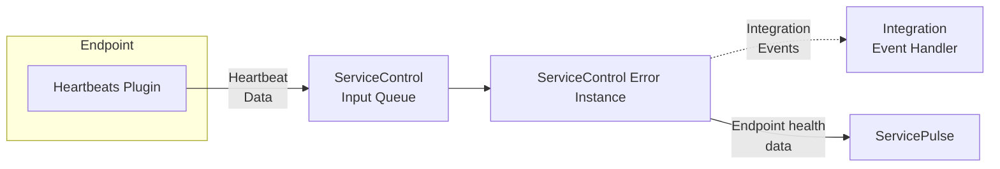

The Heartbeat plugin enables endpoint health monitoring by sending regular heartbeat messages from the endpoint to a ServiceControl instance. The ServiceControl instance keeps track of which endpoint instances are sending heartbeats and which ones are not.

> [!NOTE]
> Even if an endpoint can send heartbeat messages, other failures may occur within the endpoint and its host that prevent it from performing as expected. For example, the endpoint may not be able to process incoming messages, or it may be able to send messages to the ServiceControl queue but not to another queue. [Performance metrics](/monitoring/metrics/) can be used to monitor the processing of messages within an endpoint.

## Set up Heartbeats

To enable heartbeat monitoring in an environment:

1. [Install a ServiceControl instance](/servicecontrol/servicecontrol-instances/)
2. [Install and configure the Heartbeat plugin in endpoints that need to be monitored](install-plugin.md)
3. [View the status of monitored endpoints in ServicePulse](in-servicepulse.md)
4. Optionally [subscribe to integration events from ServiceControl when endpoints start/stop heartbeating](notification-events.md)

When an endpoint starts sending heartbeat messages, the ServiceControl instance will mark the endpoint as "active". If the ServiceControl instance stops receiving heartbeat messages from an endpoint, it will mark that endpoint as "inactive".

The Heartbeats plugin is only able to determine if the endpoint is running and sending heartbeat messages. For more sophisticated endpoint health checks, develop a [custom check](/monitoring/custom-checks/)
