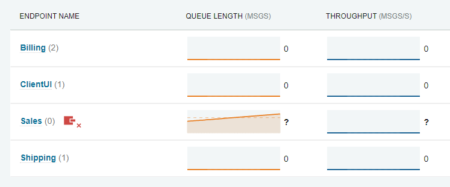

ServicePulse collects and displays performance monitoring data about running endpoints on the Monitoring tab.

NOTE: ServicePulse will only display the monitoring tab if it is configured to point to a ServiceControl monitoring instance.

The monitoring tab shows a list of logical endpoints as well as the performance data collected about those endpoints. If a logical endpoint is running more than one physical instance, a badge will show a count of physical instances.

Clicking on an endpoint in the monitoring tab will open the endpoint details page.

The endpoint details page shows larger graphs for each of the performance metrics gathered for the logical endpoint. It also contains several breakdown views.

The default breakdown view is by Message Type which shows performance metrics for each type of message that the endpoint processes

The second breakdown view is by instance. Each logical endpoint can be running one or more physical instances. This view shows a breakdown of performance metrics for each physical instance.

NOTE: Each physical instance should be configured with its own instance id, which is shown here. See [Installing the plugin](install-plugin.md) for more information about instance ids.

## Reporting period

The monitoring tab and the endpoint details page both contain an option to change the reporting period.

All graphs present the data collected during this reporting period. Where an average is shown, it is the average over the selected reporting period.

NOTE: The screen is refreshed more frequently when a shorter reporting period is selected.

## Managing the list of endpoints

The list of endpoints in the monitoring view can be managed in several ways.

Endpoints can be filtered using a keyword in the filter input:

Grouping can be applied in order to group endpoints that share similar prefixes in their names. The prefix of an endpoint is subdivided in segments delimited by periods (`.`). The number of segments available for grouping can be selected and can go up to the total number of segments detected in the prefix.

Results can be sorted by clicking the respective column label. If clicked again, sorting is toggled between ascending and descending order. When sorting by any of the metrics, the average metric value will be used for sorting. If the list switches sorting positions too quickly, then a longer period of time may need to be selected to obtain more stable averages.

NOTE: Sorting can only be used if no endpoint grouping is applied.

## Data retention

All performance metric data is retained in memory in the ServiceControl Monitoring instance. Restarting the ServiceControl Monitoring instance will cause all performance metric data to be lost.

Performance metric data is only kept by the ServiceControl Monitoring instance long enough to support the most prolonged reporting period (1 hour).

## Disconnected endpoints

Overview:

If all instances of an endpoint stop sending metric data, a connectivity warning indicator will appear.

Details:

This connectivity warning indicator appears in the instances breakdown on the endpoint details page for each instance that is not sending metric data.

### Removing disconnected endpoints

If the endpoint instance should be removed from the set of instances for a logical endpoint, this can be done by hovering over the stale instance row and clicking the "Remove endpoint" icon.

This removes the endpoint instance from the list of tracked endpoint instances for that logical endpoint.

## Endpoints with failed messages

If ServicePulse is aware of failed messages to be processed by an endpoint, it will show a badge indicating how many failed messages there are.

Click this badge to review the failed messages for this endpoint. See [Failed Message Monitoring](/servicepulse/intro-failed-messages.md) for more details.
