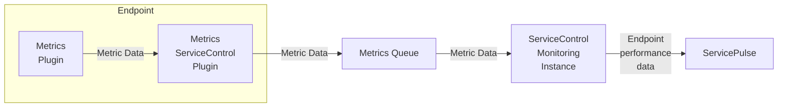

The Metrics plugin collects metric data about the performance of running endpoints. This data can be forwarded to a ServiceControl Monitoring instance and then viewed in ServicePulse.

To see performance monitoring in action, try our [standalone demo](/tutorials/monitoring-demo/).

For a full list of the performance metrics captured and their formal definitions, see [Metric definitions](definitions.md).

## Set up Metrics

To enable collecting metrics in an environment:

1. [Install a ServiceControl Monitoring instance](/servicecontrol/monitoring-instances/)
2. [Install and configure the ServiceControl Metrics plugin in each endpoint](install-plugin.md)
3. [View the performance data collected for endpoints in ServicePulse](in-servicepulse.md)

NOTE: [Monitoring NServiceBus solutions: Getting started](/tutorials/monitoring-setup/) is an in-depth, step-by-step tutorial about installing and configure everything to get the most out of performance monitoring.

## Reporting metric data to other places

- Metrics can be reported to [Windows Performance Counters](performance-counters.md).
- [Observing raw metric data allows reporting to any 3rd party metric database](raw.md).