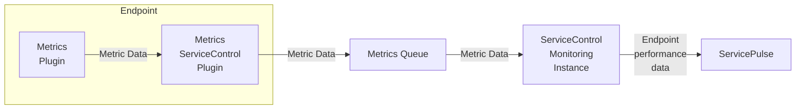

The Metrics plugin collects metric data about the performance of running endpoints. This data can be forwarded to a ServiceControl monitoring instance and then viewed in ServicePulse.

To see performance monitoring in action, try the [standalone demo](/tutorials/monitoring-demo/).

For a full list of the performance metrics captured and their formal definitions, see [Metric definitions](definitions.md).

## Set up metrics

To enable collecting metrics in an environment:

1. [Install a ServiceControl monitoring instance](/servicecontrol/monitoring-instances/)
2. [Install and configure the ServiceControl Metrics plugin in each endpoint](install-plugin.md)
3. (**MSMQ Transport only**) [Install the MSMQ queue length reporter in each endpoint](msmq-queue-length.md)
4. [View the performance data collected for endpoints in ServicePulse](in-servicepulse.md)

NOTE: [NServiceBus monitoring setup tutorial](/tutorials/monitoring-setup/) is an in-depth, step-by-step tutorial about installing and configuring everything to get the most out of performance monitoring.

## Performance impact on system resources

A ServiceControl monitoring instance is more lightweight than a regular ServiceControl instance. Nevertheless, it is not recommended to host a monitoring instance on the same machine that is hosting production endpoint instances.

### Wire usage

Each endpoint instance collects performance metrics which are buffered and then sent. A single metrics message contains a batch of values written in a compact binary format, making reporting very lightweight.

### Storage usage

A Service Control Monitoring instance processes Metric. The metric data is stored in RAM only. Logfiles are still written to disk. The metrics data are stored for at most one hour. A 100MB process can hold state for at least 100 endpoint instances.

### CPU usage

The metrics service is only performing simple summing aggregation logic. The CPU usage is low.

## Reporting metric data to other places

- Metrics can be reported to [Windows Performance Counters](performance-counters.md).
- [Observing raw metric data allows reporting to any 3rd party metric database](raw.md).
