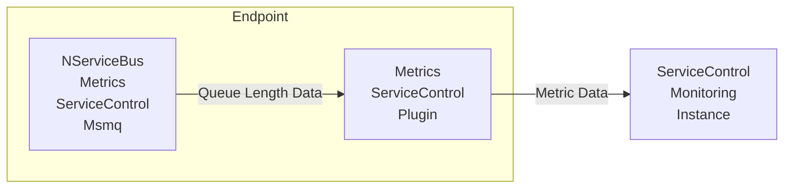

The `NServiceBus.Metrics.ServiceControl.Msmq` component monitors endpoints' queue length and passes that data to `NServiceBus.Metrics.ServiceControl` which in turn sends it to an instance of the `ServiceControl.Monitoring` service.

## Configuration

No configuration is required. Reporting is configured automatically.
