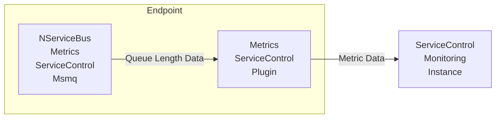

The component `NServiceBus.Metrics.ServiceControl.Msmq` monitors endpoints' queue length and passes that data to `NServiceBus.Metrics.ServiceControl` which in turn sends it to an instance of `ServiceControl.Monitoring` service.

## Configuration

No configuration is required. The reporting will be configured automatically.
