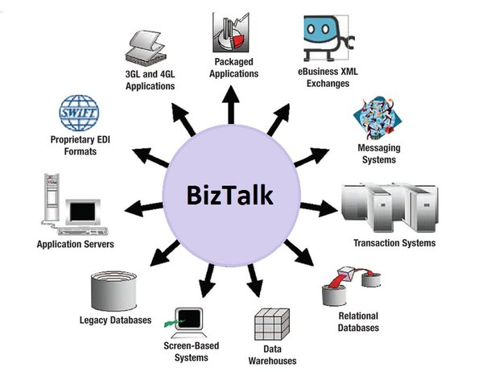
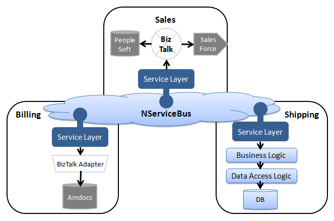

NServiceBus is designed for communication between business-oriented services in SOA and DDD projects. It is not a replacement for RPC technologies such as WCF or broker integration tools like BizTalk. Successful systems use a mix of approaches and technologies for communication, not just NServiceBus.

This article discusses the similarities and differences between NServiceBus and its Microsoft counterparts.

## Bus versus broker architectural styles 

A "service bus" is often illustrated as a central box, through which all communication goes. Despite the common understanding, that's actually a description of the **_broker architectural style_**. 

A good example is BizTalk:

A **_bus_** in the context of the **_bus architectural style_**, isn't a physical entity. There's no physical _bus_ one can point to in the network topology. The _bus_ is part of the infrastructure that is run in-process with a given application's code. It's similar to a peer-to-peer mesh that runs alongside code.

A good example is WCF:

In terms of architectural style, NServiceBus is more similar to WCF than BizTalk. Just as it is possible to write a host process and activate WCF explicitly within it, the same can be done with NServiceBus. 

## NServiceBus and BizTalk

BizTalk is a centralized message broker with many adapters for third-party applications. Its primary use case is integration with existing systems and legacy applications, possibly running on different technologies and using proprietary protocols. This is a classical Enterprise Application Integration (EAI) situation and is not what service buses are meant to address.

In these cases, NServiceBus can be used in combination with BizTalk. NServiceBus would handle the communication between the high-level business services. BizTalk would be responsible for the integration with existing systems and legacy applications within the relevant services, without crossing the service boundary. 

When designing systems, keep in mind that mixing logical orchestration and routing with business logic, data access, and web services calls results in having slow, complex and unmaintainable code. Divide those responsibilities carefully. Note that when BizTalk is used within a service it is just an implementation detail that doesn't impact any other services. Keeping it within a service boundary avoids typical performance and maintainability problems.

## Handling long-running business processes

Unless developers are careful about how they connect workflow activities, transaction scopes, and communications activities, the process state can get corrupted and exposed to remote services and clients. NServiceBus is designed to handle long-running business processes in a robust and scalable way using [sagas](/nservicebus/sagas/). Transactions are automatically handled on a per-message basis; by default they span all communications and state-management work done by an endpoint. An exception causes all work to be undone, including the sending of any messages, so that remote services and clients do not get exposed to inconsistent data.
