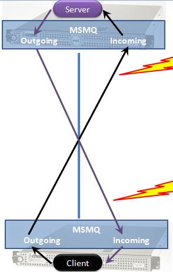

Messaging can be used to ensure autonomy and loose coupling in systems, both at design time and at run time. However, in order to benefit from those qualities applications must be carefully designed and good practices followed.

Service-oriented architecture (SOA) and event-driven architecture provide the basis for identifying where to use messaging frameworks, such as NServiceBus. Strategic Domain-Driven Design helps bridge the gap between business and IT. It's an essential strategy for identifying service boundaries and finding meaningful business events.

## How NServiceBus aligns with SOA

<iframe allowfullscreen frameborder="0" height="300" mozallowfullscreen src="https://player.vimeo.com/video/113515335" webkitallowfullscreen width="400"></iframe>

In this presentation Udi Dahan explains the process of finding the right service boundaries. The presentation starts with introduction to SOA, explains challenges with traditional layered architectures and covers an approach that cuts across all application layers, outlining the inherent lines of loose and tight coupling. Finally, Udi shows how these vertical services collaborate together using events in order to bring about flexible and high performance business processes.

## Drilling down into details

One of the problems in many systems is that they are fragile. One part of the system slows down, affecting other parts of the system, ultimately crashing the entire system. 

One of the primary design goals of NServiceBus is to eliminate that flaw by guiding developers to write code that is robust in production environments. That robustness prevents data loss under failure conditions.

To make effective use of NServiceBus, it is necessary to understand the distributed systems architecture it is designed to support. Those basic principles are explained briefly in this article. For more in-depth coverage, see the [ADSD course](https://particular.net/adsd).  

The basic communication pattern that enables robustness is one-way messaging, also known as "fire and forget". Since the amount of time it can take to communicate with another machine across the network is unknown and unbounded, asynchronous communication in NServiceBus is based on a store-and-forward model.

## Messaging versus RPC

NServiceBus enforces queued messaging, which has profound architectural implications. The principles and patterns underlying queued messaging are decades old and battle-tested through countless technological shifts.

It's very simple to build an application and get it working using traditional RPC techniques that WCF supports. However, scalability and fault-tolerance are inherently hindered when using blocking calls. Scaling up and throwing more hardware at the problem has little effect.

NServiceBus avoids these problems from the beginning. There's no such thing as a blocking call with one-way messaging. Common, transient errors can be resolved automatically with retries, and it's easy to recover from failures that require some manual intervention. Above all, even when a part of the system fails, no data gets lost. 

In order to learn more about the relationship between messaging and reliable, scalable, highly-available systems, watch the webinar about [handling failures with NServiceBus](https://particular.net/webinars/handling-failures-with-nservicebus).

See also other webinars and presentations on the [Videos and Presentations](https://particular.net/videos) page.

### Store-and-forward messaging

In this model, when the client processes calls an API to send a message to the server process, the API returns control to the calling thread before the message is sent. At that point the transfer of the message across the network becomes the responsibility of the messaging technology. There may be communications interference, e.g. the server machine may be down, or a firewall may slow the transfer. Also, even though the message may have reached the target machine, the target process may currently be down.

The client process is oblivious to those problems; as soon as the message is sent, messaging infrastructure takes over. As a result, critical resources like threads are not held waiting for the message processing to complete. This prevents the client process from losing stability while waiting for a response from another machine or process.

### Request/response and one-way messaging

The common pattern of request/response, which is more accurately described as synchronous Remote Procedure Call, is handled differently when using one-way messaging. From a network perspective, request/response is just two one-way interactions, as illustrated in the diagram:

This communication is especially critical for servers as clients behind problematic network connections now have little effect on the server's stability. If a client crashes after sending the request but before the server sends a response, the server will not have resources tied up waiting until the connection times out.

When used in combination with durable messaging, the system-wide robustness increases even more.

Durable messaging differs from regular store-and-forward messaging in that the messages are persisted to disk locally before attempting to be sent. This means that if the process crashes before the message is processed, the message is not lost. In server-to-server scenarios, where a server can complete a local transaction but might crash a second later, one-way durable messaging makes it easier to create an overall robust system even using unreliable building blocks.

A different communication style involves one-to-many communication.

### Publish/subscribe

In this pattern, the sender of the message isn't aware of the subscriber's details. The additional loose coupling comes at the cost of subscribers explicitly opting-in to receiving messages, as shown in the diagram below.

#### Subscriptions

Subscribers need to know which endpoint is responsible for publishing a given message. This information is usually available as part of the contract, specifying to which endpoint a subscriber should send its request. Part of the subscription message is a subscriber's "return address", i.e. the address of the endpoint that wants to receive messages.

Keep in mind that the publisher may choose to store the information concerning which subscriber is interested in which message in a highly available manner. This allows multiple processes on multiple machines to publish messages to all subscribers, even if the particular publisher didn't receive the given subscription request.

Subscribers don't have to subscribe themselves. Through the use of the Return Address pattern, one central configuration station could send multiple messages to each publisher, specifying which subscriber endpoints to subscribe to which message.

Another approach that can be used is to have multiple physical subscribers which act as a single logical subscriber. This makes it possible to load balance the handling of messages between multiple physical subscribers without any explicit coordination on the part of the publisher or any one subscriber. All that is needed is that each subscriber should specify the same logical return address in the subscription message.

#### Publishing

Publishing a message involves sending that message to all endpoints that previously subscribed to that message type.

Messages that are published often represent events, i.e. things that have happened. For instance, Order Cancelled, Product Out of Stock, and Shipping Delayed. Sometimes an event is generated as a result of handling a previous command message, for instance an Order Cancelled event for a Cancel Order command. A publisher is not required to publish a message after handling a command message although it is a common scenario.

Since many command messages can be received in a short period of time, publishing an event to all subscribers for every command message multiplies the incoming load and, as such, is a less than optimal solution. A better solution has the publisher batching all the changes that occurred in a given period of time into a single published message. The appropriate period of time depends on the Service Level Agreement of the publisher and its commitment to the freshness of the data. For instance, in the financial domain the publishing period may be 10 ms, while in the business of consumer e-commerce, a minute may be acceptable.

### Command query separation

Many systems provide users with the ability to search, filter, and sort data. While one-way messaging and publish/subscribe are core underlying patterns of these features, they aren't executed in a regular client-server request/response fashion.

In regular client-server system, the server exposes all CRUD (create, read, update, and delete) operations to the client. However, when users read data they often don't require it to be up-to-date; data may be stale for short periods of time. At the same time, retrieving data from the same table that's used for highly consistent transaction processing creates contention, resulting in poor performance for all CRUD actions under higher load.

A solution that avoids this problem separates commands and queries at the system level, even above client and server. In this solution there are two "services" that span both client and server: one in charge of commands (create, update, delete), and the other in charge of queries (read). These services communicate only via messages and keep their data separate, possibly even in separate databases. One service cannot access the data of the other, as shown in the following diagram:

The command service publishes messages with data changes, to which the query service subscribes. When the query service receives such notifications, it saves the data in its own data store which may have a different schema (optimized for queries, such as a star schema). The query service may also keep all data in memory if the data is small enough.
