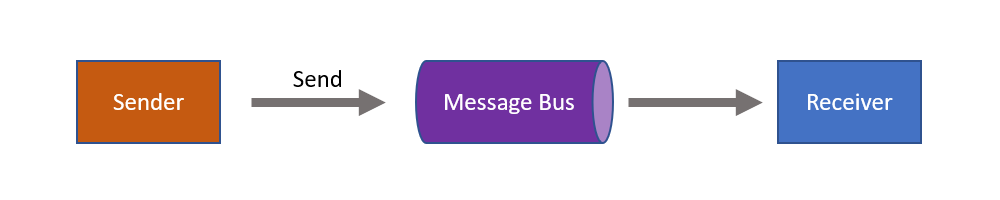
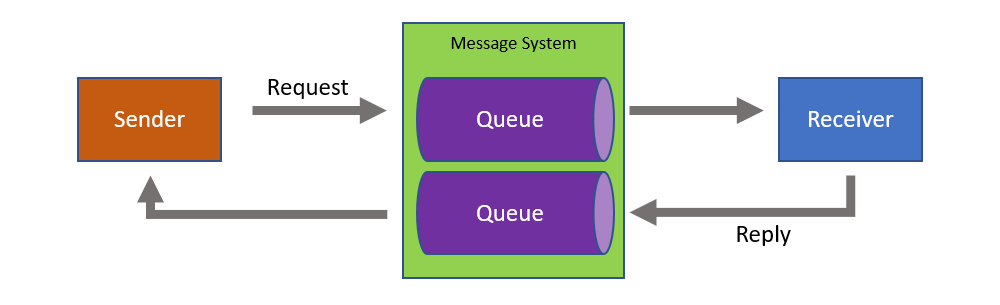

Messaging can be used to ensure autonomy and loose coupling in systems, both at design time and at run time. However, in order to benefit from those qualities, applications must be carefully designed and good practices followed.

Service-oriented architecture (SOA) and event-driven architecture (EDA) provide the basis for identifying when where to use messaging frameworks, such as NServiceBus. Strategic domain-driven design helps bridge the gap between business and IT and is an essential strategy for identifying service boundaries and finding meaningful business events.

## How NServiceBus aligns with SOA

<iframe allowfullscreen frameborder="0" height="300" mozallowfullscreen src="https://player.vimeo.com/video/113515335" webkitallowfullscreen width="400"></iframe>

In this presentation Udi Dahan explains the process of finding the right service boundaries. The presentation starts with an introduction to SOA, explains challenges with traditional layered architectures and covers an approach that cuts across all application layers, outlining the inherent lines of loose and tight coupling. Finally, Udi shows how these vertical services collaborate using events, enabling flexible and high performance business processes.

## Drilling down into details

A common problem in many systems is that they are fragile. One part of the system slows down, affecting other parts of the system, ultimately crashing the entire system.

A primary design goal of NServiceBus is to eliminate that flaw by guiding developers to write code that is robust in production environments. That robustness prevents data loss under failure conditions.

To make effective use of NServiceBus, it is necessary to understand the distributed systems architecture it is designed to support. Those basic principles are explained briefly in this article. For more in-depth coverage, see the [Advanced Distributed Systems Design course](https://particular.net/adsd).

The basic communication pattern that enables robustness is one-way messaging, also known as "fire and forget".

## Messaging versus RPC

NServiceBus enforces queued messaging, which has profound architectural implications. The principles and patterns underlying queued messaging are decades old and battle-tested through countless technological shifts.

It's quite easy to build an application and get it working using traditional remote procedure call (RPC) techniques like webservices (ASMX or WCF), HTTP API (ASP.NET WebAPI) or winsockets (SignalR). However, scalability and fault-tolerance are inherently hindered when using synchronous, blocking calls. Scaling up and throwing more hardware at the problem has little effect.

NServiceBus makes applications loosely coupled by communicating asynchronously, which also makes the communication more reliable because the two applications do not have to be running at the same time. There are no blocking calls with asynchronous, one-way messaging. Common, transient errors can be resolved automatically with retries, and it's easy to recover from failures that require some manual intervention. Above all, even when a part of the system fails, no data gets lost.

To learn more about the relationship between messaging and reliable, scalable, and highly-available systems, watch the webinar about [handling failures with NServiceBus](https://particular.net/webinars/handling-failures-with-nservicebus) and other [webinar and presentations](https://particular.net/videos).

### Message system

NServiceBus is messaging middleware that makes use of a message broker like RabbitMQ, Azure Service Bus, Amazon SQS and others.

A message broker can be compared with a database, but instead of storing data and indexing it, it focuses on transferring data from one application to another. A client will call an API to send a message, and the API returns control to the calling thread after the message is received by the message broker.  At that point the transfer of the message across the network becomes the responsibility of the messaging technology. 

The client process is oblivious to problems that receiving clients might have; as soon as the message is sent, messaging infrastructure takes over. As a result, critical resources like threads are not held waiting for the message processing to complete. This prevents the client process from losing stability while waiting for a response from another machine or process.

##### Temporal decoupling

This means sender and receiver are *temporal decoupled* from each other. This means the sender and receiver execute their work independent of time. As a result there is no time availability dependency between the sender and the receiver.

##### Asynchronous communication versus asynchronous execution

This is not to be confused with asynchronous execution of code within a single process, where multiple threads execute code in parallel. This speeds up the execution of code that would historically be executed one block of code (a method) after the other. This is different from asynchronous communication where two components are not communicating with each other directly, but through a messaging system.

##### Store and forward

In the store and forward model, messages are delivered differently to the receiving queue then with a centralized message broker. After the messaging API returns control to the calling thread, the message is often stored locally on the machine the component is running on. Only when the receiving queue (not uncommonly on a different machine) is available, the message is transferred across the network.

This has both its benefits and disadvantages. Although it does not rely on a centralized message broker being available, scaling is more difficult. In a cloud environment, this model is not possible, mostly because machines and disks can be moved across a datacenter without awareness of a system. The result will be immediate message loss which can occur rather often.

### One-way and request/response messaging

One way messaging is when a component sends a message to another component via a messaging system.

Request/Response is a common pattern to use in distributed systems where a system makes use of two separate occasions of one-way messaging, but to achieve the result that a component can request information from another component via messaging. Thus still being temporally decoupled from each other and still have the benefits that messaging provides.

From a network perspective, request/response is just two one-way interactions:

This communication pattern is particularly important for servers, as clients behind problematic network connections now have little effect on a server's stability. If a client crashes after sending the request, but before the server sends a response, the server will not have resources tied up waiting until the connection times out.

A different communication style involves one-to-many communication.

##### Commands

Messages send often represent commands, i.e. tasks that need to be done. For example "submit order", "cancel order" and "update inventory". Command messages are processed by a single receiver, but can notify other components by publishing an event.

Read more about [how commands are used in NServiceBus](/nservicebus/messaging/messages-events-commands.md).

### Publish/subscribe

In this pattern, the sender of a message is not aware if there are any subscribers neither is it aware of any subscriber its details.

#### Publishing

Publishing a message differs sending a message using the asynchronous one-way messaging pattern, for two reasons:

1. There can be multiple receivers
2. The receivers don't have to be known during the design of the sender

One of the biggest benefits is that additional receivers can be added later, without modifying the sender. This means that besides temporal decoupling, the sender is also logically decoupled from any possible receiver.

##### Events

Messages that are published often represent events, i.e. things that have happened. For example, "order cancelled", "product went out of stock", and "shipping delayed". Sometimes an event is published after handling a command. For example, successful handling of a "cancel order" command may result in publishing an "order cancelled" event. A publisher does not have to publish an event after handling a command, but it is a common scenario.

Since many commands may be received in a short period of time, publishing an event to all subscribers for each command may saturate the system with messages, and may not be the best solution. A better solution may be to publish a single message as a result of all the commands that were handled over a given period of time. The appropriate period of time depends on the Service Level Agreement of the publisher with respect to how soon an event should be published after a given command is handled. For example, in a financial domain that may have to be as little as 10 ms, but in an e-commerce, a minute may be acceptable.

Read more about [how events are used in NServiceBus](/nservicebus/messaging/messages-events-commands.md).

#### Subscriptions

Subscribers are also both temporally and logically disconnected in that they do not need to be aware of the location and the working of the publisher. The message system will take care of the subscriptions and make sure published messages will arrive at the subscriber. This is often done based on the contract.

### Command query separation

Many systems provide users with the ability to search, filter, sort, and change data.

In some client-server systems, a server simply exposes all CRUD (create, read, update, and delete) operations to the client. However, when the same database table is used both to perform CRUD operations in a highly consistent manner while handling commands, and to query data for users to read, those commands and queries contend with each other. This often results in poor system performance, both for commands and queries.

This problem can be avoided by separating commands and queries at the system level, above even the client and server. This solution takes advantage of the fact that in many, or even most, scenarios, the data returned to users does not have to be completely up to date; it can be slightly out of date without causing significant problems.

In this solution there are two components that each span both client and server. One component handles commands and the other responds to queries. The components communicate using only messages and their data is held separately, possibly even in separate databases, servers, or storage technologies. One component cannot access the other's data:

The command component publishes messages and the query component subscribes to them. When the query component receives a message, it stores appropriate data in a schema which is often optimized for queries, such as a star schema in a database or a cache of JSON documents. It may also cache some query responses in memory.