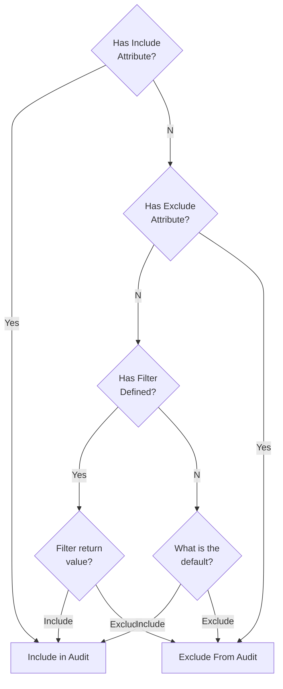

`NServiceBus.AuditFilter` adds support for filtering which messages are sent to the [Audit Queue](/nservicebus/operations/auditing.md).

## Usage

### Decorate messages with attributes

snippet: MessageToIncludeAudit

snippet: MessageToExcludeFromAudit

### Add to EndpointConfiguration

With include by default

snippet: DefaultIncludeInAudit

With exclude by default

snippet: DefaultExcludeFromAudit

### Delegate filter fallback

The fallback/default value can also be controlled by a delegate.

snippet: FilterAuditByDelegate

## Include/Exclude logic flow

