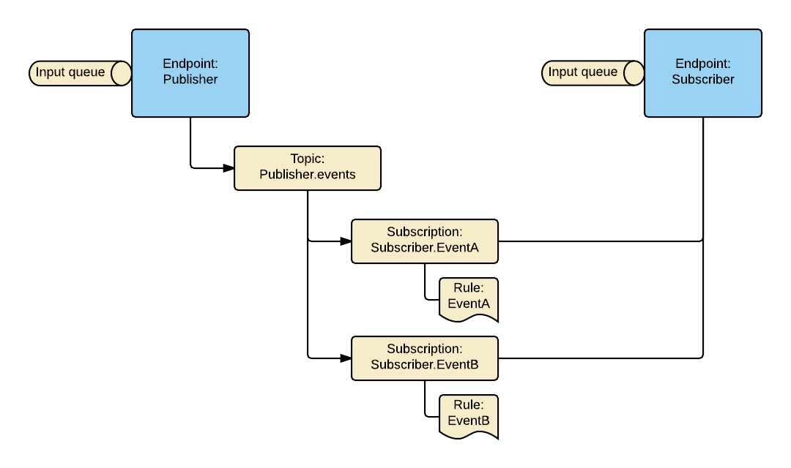
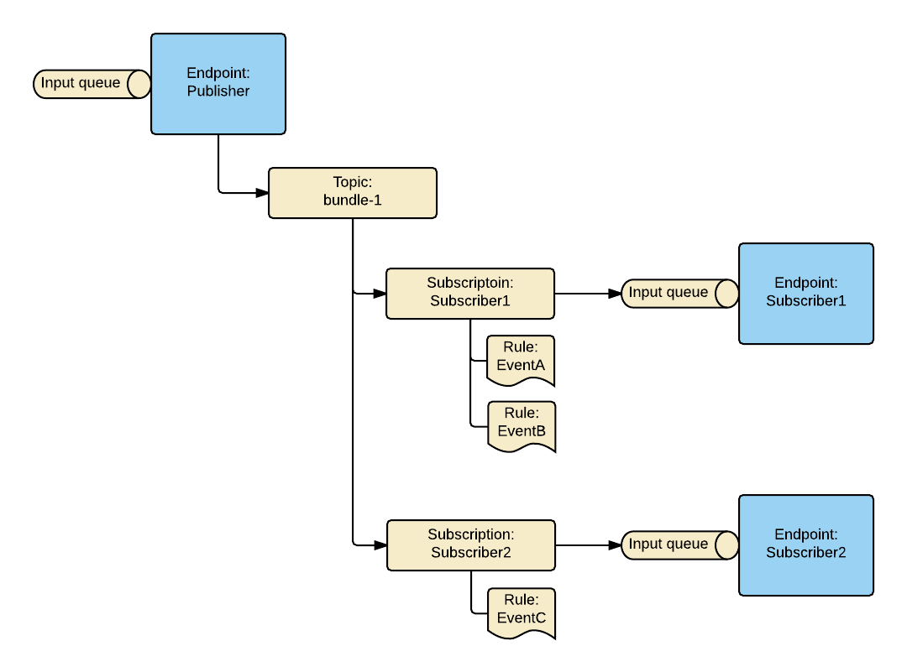

Messaging topology is a specific arrangement of the messaging entities, such as queues, topics, subscriptions, and rules.

Azure Service Bus transport operates on a topology created on the broker. Topology handles exchanging messages between endpoints, by creating and configuring Azure Service Bus entities.

## Version 7 and above

In Version 7 and above, the following topologies are available:

 1. `EndpointOrientedTopology`
 1. `ForwardingTopology`

The `EndpointOrientedTopology` is backward compatible with the Azure Service Bus transport Version 6 and below.

The `ForwardingTopology` was introduced to take advantage of the broker nature of the Azure Service Bus and to leverage its native capabilities. It is the recommended option for new projects.

Both topologies create a single input queue per endpoint and implement [Publish-Subscribe](/nservicebus/messaging/publish-subscribe/) mechanism. However, there is a significant difference in the way the mechanism is implemented.

Starting from Version 7, no default topology is set by the Azure Service Bus transport. Topology has to be configured using [configuration API](/nservicebus/azure-service-bus/configuration/configuration.md).

### Endpoint Oriented Topology

In the `EndpointOrientedTopology` each publishing endpoint creates a topic called `<publishing_endpoint_name>.events`. The subscribing endpoints subscribe to the topic, by creating a subscription for a particular event type called `<subscriber_endpoint_name>.<event_type_name>`. Note that each subscription has a single rule, used to filter a specific event type.

When a publisher raises an event, it is published to the publisher topic. Then the subscription entities filter events using the associated rules. Finally, the subscriber endpoint pulls events for processing.

The example below demonstrates a publisher called `Publisher` and a subscriber `Subscriber`. `Publisher` can raise two events, `EventA` and `EventB`. A subscriber called `Subscriber` subscribes to both events. Note that two subscription entities are created, one per event type. Each subscription entity filters out events using a rule associated with the subscription.

The `EndpointOrientedTopology` topology has several drawbacks:

 1. In order to subscribe to an event, the subscriber must know the publishing endpoint's name, causing coupling between publisher and subscriber. Refer to [Publisher names configuration](/nservicebus/azure-service-bus/publisher-names-configuration.md) article for more details.
 1. Multiple subscription entities per subscriber cause polymorphic events to be delivered multiple times to the subscribing endpoint. To handle polymorphic events with `EndpointOrientedTopology` a [workaround](/samples/azure/polymorphic-events-asb/) has to be implemented.
 1. When a single subscriber is offline for an extended period of time and events are not consumed, it can cause events overflow. Since a single topic per publisher is used for all the subscribers, when events overflow is happening it will affect all subscribers and not just the one that is offline.

### Forwarding Topology

The `ForwardingTopology` is a new topology that was designed to take advantage of several native broker features offered by Azure Service Bus. Unlike `EndpointOrientedTopology`, it doesn't work with a single topic per publisher. All publishers use a single topic bundle. 

Subscriptions are created under topic bundle with one subscription entity per subscribing endpoint. Each subscription contains multiple rules, one rule per event type that the subscribing endpoint is interested in. This allows complete decoupling between publishers and subscribers. All messages received by subscription are forwarded to the input queue of the subscriber.

This topology solves the polymorphic events and the events overflow problems  that `EndpointOrientedTopology` has.

#### Quotas and limitations

The `ForwardingTopology` supports up to 2,000 endpoints with up to 2,000 events in total. Since multiple rules per subscriptions are used, topics cannot be partitioned.

#### Topologies comparison

|                                | EndpointOrientedTopology  | ForwardingTopology |
|--------------------------------|---------------------------|--------------------|
| Publisher/Subscriber coupling  | yes                       | no                 |
| Polymorphic events support     | no                        | yes                |
| Events overflow protections    | no                        | yes                |

## Version 6 and below

The Azure Service Bus transport has always supported a single default topology out-of-the-box. It is equivalent to the `EndpointOrientedTopology` introduced in Version 7 and above.
