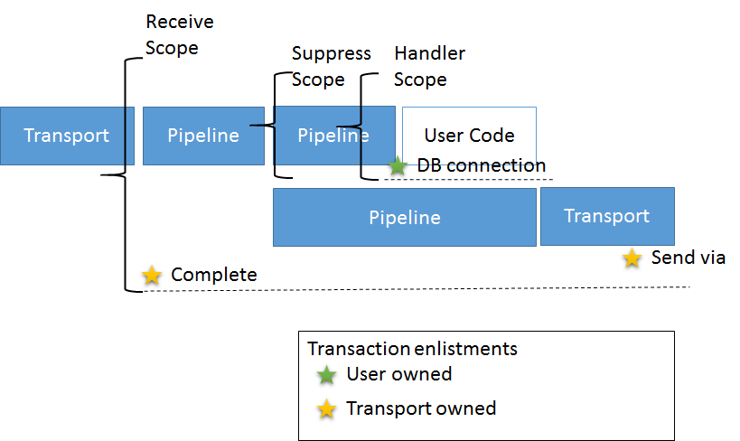
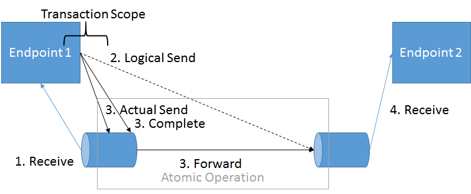

In NServiceBus version 6 and above, the shape of the pipeline has changed so that a transport is in full charge of how a given transaction mode is implemented. A transaction scope is no longer mandatory in order to orchestrate dispatching of messages with complete/rollback behavior. The Azure Service Bus transport only uses a transaction scope to implement the `SendAtomicWithReceive` transaction mode. Other modes work without any scope at all. The new architecture for `SendAtomicWithReceive` is schematically represented like this:

Note the [fork in the pipeline](/nservicebus/pipeline/steps-stages-connectors.md) which is separating the user code invocation path from the dispatching path. By putting a suppress scope around this section of the pipeline, the transport can prevent any other transactional resource from enlisting in the scope.

Furthermore the Azure Service Bus transport now also takes advantage of a little known capability if the Azure Service Bus SDK, [the via entity path / transfer queue](https://github.com/Azure-Samples/azure-servicebus-messaging-samples/tree/master/AtomicTransactions) . Using this feature, send operations to different Azure Service Bus entities can be executed via a single entity, usually the receive queue.  Schematically it works like this:

Combining these capabilities, allows Azure Service Bus Transport to support `SendAtomicWithReceive`, `ReceiveOnly` and `None` transaction mode levels.

NOTE: When developing a satellite it needs to be taken into account that `SendAtomicWithReceive` will wrap the satellite in a transaction scope which cannot be reused by other transactional resources, there a suppress scope should be added around the invocation of any other transactional resources.

include: send-atomic-with-receive-note