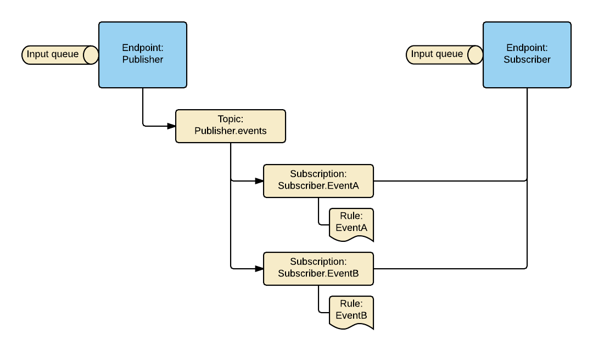
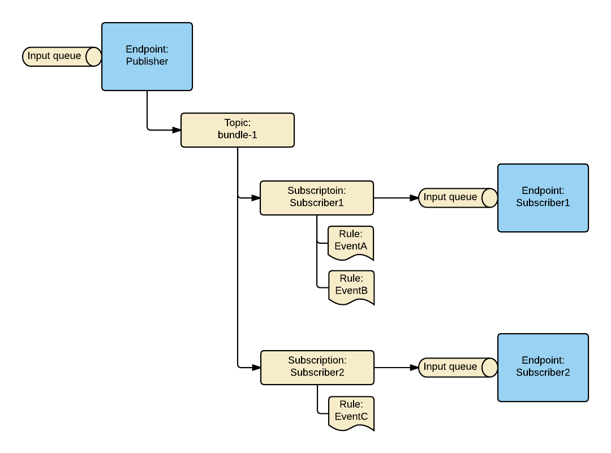

Messaging topology is a specific arrangement of the messaging entities, such as queues, topics, subscriptions, and rules.

Azure Service Bus transport operates on a topology created on the broker. Topology handles exchanging messages between endpoints, by creating and configuring Azure Service Bus entities.

## Version 7 and above

In Version 7 and above, the following topologies are available:

 1. `EndpointOrientedTopology`
 1. `ForwardingTopology`

The `EndpointOrientedTopology` is backward compatible with Azure Service Bus transport Version 6 and lower.

The `ForwardingTopology` was introduced to take advantage of the broker nature of Azure Service Bus and to leverage its native capabilities. It is the recommended option for new projects.

Both topologies create a single input queue per endpoint and implement [Publish-Subscribe](/nservicebus/messaging/publish-subscribe/) mechanism. However, there is a significant difference in the way the mechanism is implemented in each of them.

Starting from Version 7, no default topology is set by the Azure Service Bus Transport. Topology has to be configured using [configuration API](/nservicebus/azure-servicebus/configuration.md).

### Endpoint Oriented Topology

In the `EndpointOrientedTopology` each publishing endpoint creates a topic called `<publishing_endpoint_name>.events`. The subscribing endpoints subscribe to the topic, by creating a subscription for a particular even type called `<subscriber_endpoint_name>.<event_type_name>`. Note that each subscription has a single rule, used to filter a specific event type.

When a publisher raises an event, it is published to the publisher topic. Then the subscription entities filter events using the associated rules. Finally, the subscriber endpoint pulls events for processing.

Example below demonstrates a publisher called `Publisher` and a subscriber `Subscriber`. `Publisher` can raise two events, `EventA` and `EventB`. A subscriber called `Subscriber` subscribes to both events. Subscriber subscribes by creating two subscription entities, one per event type. Each subscription entity filters out events using a rule associated with the subscription.

This topology has several drawbacks:

 1. In order to subscribe to an event, subscriber must know the publishing endpoint name, causing publisher and subscriber coupling. See [Publishers name configuration](/nservicebus/azure-servicebus/publisher-names-configuration.md).
 1. Multiple subscription entities per subscriber cause polymorphic events to be delivered multiple times to the subscribing endpoint. To handle polymorphic events with `EndpointOrientedTopology` a [workaround](/samples/azure/polymorphic-events-asb/) has to be implemented.
 1. When a single subscriber if offline for an extended period of time and events are not consumed, it can cause events overflow. Since a single topic per publisher is used for all the subscribers, when events overflow is happening, it will affect all subscribers and not just the one that is offline.

### Forwarding Topology

`ForwardingTopology` is the new topology that was designed to take advantage of several native broker features offered by Azure Service Bus. Unlike `EndpointOrientedTopology`, it doesn't work with a single topic per publisher. All publishers use a topic bundle (LINK link-to-bundles). Subscriptions  are created under topic bundle with one subscription entity per subscribing endpoint. Each subscription contains multiple rules. A rule per event type that subscribing endpoint is interested in. This allows complete decoupling between publishers and subscribers. All messages received by subscription are forwarded to the input queue of the subscriber.

This topology solves the polymorphic events and the events overflow problems `EndpointOrientedTopology` has.

#### Quotas and limitations

`ForwardingTopology` support up to 2,000 endpoints with up to 2,000 events in total. Since multiple rules per subscriptions are used, topics cannot be partitioned.

#### Topologies comparison

|                                | EndpointOrientedTopology  | ForwardingTopology |
|--------------------------------|---------------------------|--------------------|
| Publisher/Subscriber coupling  | yes                       | no                 |
| Polymorphic events support     | no                        | yes                |
| Events overflow protections    | no                        | yes                |
| Topic partitioning             | yes                       | no                 |

## Version 6 and below

The Azure Service Bus transport has always supported a single default topology out-of-the-box. It is equivalent to the `EndpointOrientedTopology` introduced in Version 7 and higher.