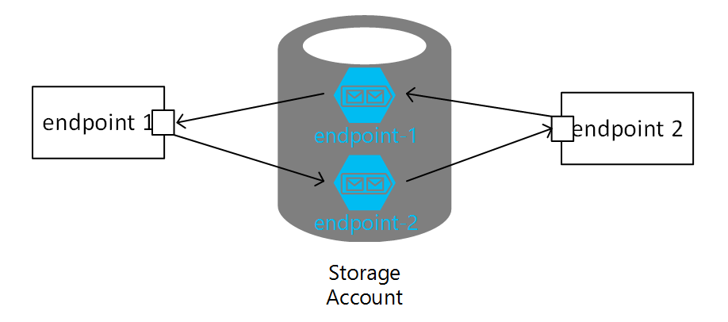

An NServiceBus-based system running on Azure Storage Queues transport using a single storage account is subject to potential throttling once the maximum number of messages is written to the storage account. To overcome this limitation, use multiple storage accounts. To better understand scale out options with storage accounts, it is necessary understand Azure storage account scalability and performance.


## Azure Storage Scalability and Performance

All messages in a queue are accessed via a single queue partition. A single queue is targeted to process up to 2,000 messages per second. Scalability targets for storage accounts can vary based on region with up to 20,000 messages per second (throughput achieved using an object size of 1KB). This is subject to change and should be periodically verified using [MSDN Azure Storage Scalability and Performance Targets](https://azure.microsoft.com/en-us/documentation/articles/storage-scalability-targets/).

When the number of messages exceeds this quota, storage service responds with an HTTP 503 Server Busy message. This message indicates that the platform is throttling the queue. If a single storage account is unable to handle an application`s request rate, an application could also leverage several different storage accounts using a storage account per endpoint. This ensures application scalability without choking a single storage account. This also allows discrete control over queue processing, based on the sensitivity and priority of the messages that are handled by different endpoints. High priority endpoints could have more workers dedicated to them than low priority endpoints.


## Scaling Out

A typical implementation uses a single storage account to send and receive messages. All endpoints are configured to receive and send messages using the same storage account.



When the number of instances with endpoints are increased, all endpoints continue reading and writing to the same storage account. Once the limit of 2,000 message/sec per queue or 20,000 message/sec per storage account is reached, Azure throttles the message throughput.


While an NServiceBus endpoint can only read from a single Azure storage account, it can send messages to multiple storage accounts. Configure this by specifying a connection string when message mapping. Each endpoint will have its own storage account to overcome the Azure storage account throughput limitation of 20,000 messages/sec.

Example: Endpoint 1 sends messages to Endpoint 2. Endpoint 1 defines message mapping with a connection string associated with the Endpoint 2 Azure storage account. The same idea applies to Endpoint 1 sending messages to Endpoint 2.

Message mapping for Endpoint 1:

```xml
<MessageEndpointMappings>
	<add Messages="Contracts" Namespace="Contracts.Commands.ForEndpoint2"
		 Endpoint="Endpoint2@connection_string_for_endpoint_2" />
</MessageEndpointMappings>
```

Message mapping for Endpoint 2:

```xml
<MessageEndpointMappings>
	<add Messages="Contracts" Namespace="Contracts.Commands.ForEndpoint1"
		 Endpoint="Endpoint1@connection_string_for_endpoint_1" />
</MessageEndpointMappings>
```

Each endpoint uses its own Azure storage account, thereby increasing message throughput.


## Using aliases for connection strings to storage accounts for Scale Out

When the message throughput is increased, by using multiple storage accounts, its worth to consider using aliases instead of raw connection strings. When applied, raw connection string values are replaced with registered aliases removing the possibility of leaking a connection string value. The concept of [using aliases for connection strings to storage accounts](/nservicebus/azure-storage-queues/configuration.md#using-aliases-for-connection-strings-to-storage-accounts) has been introduced in `NServiceBus.Azure.Transports.WindowsAzureStorageQueues` Version 7. When using a single account, aliasing connection string is limited to calling `.UseAccountAliasesInsteadOfConnectionStrings()`. When Scaling Out is applied, it requires registering an alias for each storage account.

Consider the following example:

 * Two endpoints using different accounts `account_A` and `account_B` for their input queues.
 * The `account_A` endpoint uses account with the following connection string `account_A_connection_string`.
 * The `account_B` endpoint uses account with the following connection string `account_B_connection_string`.
 * Every endpoint sends/replies to messages to the other using `@` notation.
  * `queue@account_A` is a `queue` of the `account_A` endpoint where `account_B` endpoint sends messages to.
  * `queue@account_B` is a `queue` of the `account_B` endpoint where `account_A` endpoint sends messages to.

To enable sending from `account_A` to `account_B`, following configuration has to be applied in the `account_A` endpoint

snippet:AzureStorageQueueUseMultipleAccountAliasesInsteadOfConnectionStrings1

To enable sending from `account_B` to `account_A`, following configuration has to be applied in the `account_B` endpoint

snippet:AzureStorageQueueUseMultipleAccountAliasesInsteadOfConnectionStrings2

`DefaultAccountAlias(string alias)` maps an alias of an account used by this endpoint.
`AccountRouting().AddAccount(string accountAlias, string connectionString)` adds a mapping for other accounts, enabling using `@` notation for destination addresses `queue_name@accountName`.

NOTE: The examples above use different default accounts' aliases to enable a coherent addressing. Using the same name, like `default` for all main accounts is highly discouraged as it introduces ambiguity in resolving addresses like `queue@default`. For example, when an address is interpreted as a reply address, the name `default` will point to a different connection string.


## Scale Units

Scaleout works to a certain extent, but it cannot be applied infinitely while expecting throughput to increase accordingly. Only so much throughput from a single resource or group of resources grouped together is possible.

Suitable techniques in the cloud include resource partitioning and use of scale units. A scale unit is a set of resources with well determined throughput, where adding more resources to this unit does not result in increased throughput. When the scale unit is determined, to improve throughput, create more scale units. Scale units do not share resources.

An example of a partitioned application with a different number of deployed scale units is an application deployed in various regions.


NOTE: Use real Azure storage accounts because the Azure storage emulator only supports a single fixed account named `devstoreaccount1`.