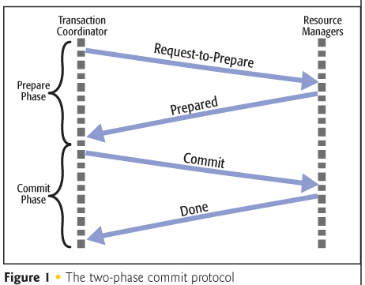

The Azure Platform and NServiceBus complement each other. Azure is a distributed, scalable, and flexible platform. NServiceBus provides high-level abstractions and features that make development in Azure easier.

There are a few things to keep in mind when developing for Azure. The most important one is the lack of (distributed) transactions.

## No transactions is the default

Transaction processing is designed to maintain system integrity (typically a database or some modern file systems and services), i.e. to always keep them in a consistent state. This is achieved by ensuring that interdependent operations are completed as a single unit of work. If any single operation fails, then the entire transaction fails and the system is reverted to the state it was in before the transaction started. This article focuses on Azure databases and storage services.

To guarantee integrity, the database engine or service must lock a certain number of records inside the transaction when updating values. Which records and how many of them are locked depends on the selected isolation level (among other things).

It is important to understand, especially in the context of cloud services, that other transactions cannot work with locked records at the same time. In a cloud or self-service environment such locks become a trust issue because external parties can leverage them to perform a denial of service attack (even unintentionally).

This is the primary reason many Azure hosted services do not support transactions at all or are very aggressive when it comes to the lock duration.
For example, Azure SQL Server supports local transactions (with .NET 4.6.1 and higher), but grants locks on resources only for 20 seconds (when requested by a system task) or 24 hours (otherwise). See [Azure SQL Database resource limits](https://docs.microsoft.com/en-us/azure/sql-database/sql-database-resource-limits) for more details.

## Transactions bound to partitions

Some Azure Services like Azure Table Storage, Azure Cosmos DB Table API, and Azure Cosmos DB SQL API offer transactionality, but the transactions are usually scoped to a single partition key. When transactions are scoped to a single partition key, all storage operations that need to be atomic have to share the same partition key on all read, update and delete operations to achieve atomicity. An additional requirement might be that the transaction needs to complete within a relatively short time window not to hold up transactional resources unnecessarily. 

## Understanding distributed transactions and the two-phase commit protocol

When both the database management system and client are under the same ownership (e.g. when SQL Server is deployed to a virtual machine), transactions are available and the lock duration can be controlled. But even in this scenario distributed transactions must be used carefully.

When multiple transaction-aware resources are involved in a single transaction, this transaction is promoted to a distributed transaction automatically. That means that handling the unit of work is performed outside the database system by the Global Transaction Manager, or Distributed Transaction Coordinator (DTC).

The coordinator is a service on the machine where the transaction started. It communicates with similar services, called resource managers, which are running on other machines involved in the transaction. They communicate using the two-phase commit protocol.

As the name implies, the two-phase commit protocol consists of two phases. During the preparation phase, the Global Transaction Manager instructs all resource managers to get ready to commit. Then all resource managers need to inform the Global Transaction Manager whether they approve the transaction. After collecting that information the Global Transaction Manager instructs all resource managers to either complete the commit or to rollback.

Note that this protocol requires two communication steps for each resource manager and requires a response from each of them to be able to continue.

**Both of these conditions are problematic in a huge data center such as Azure** because:

 * Using two communication steps per resource manager results in additional communication: 2 resources - 4 network calls, 4 resources - 16 calls, 100 resources - 400 calls, etc. This limits scalability.
 * Azure data centers consist of hundreds of thousands of machines; failure needs to be expected and all systems must be able to deal with network partitions. Network partitions result in slow or [in doubt](https://msdn.microsoft.com/en-us/library/ms681727.aspx) transactions. Therefore the requirement to wait for responses from all resource managers is problematic even if the communication overhead is manageable.

The latter is the primary reason why none of the Azure services supports distributed transactions, and the recommendation is not to use them in new designs even if it's technically possible.