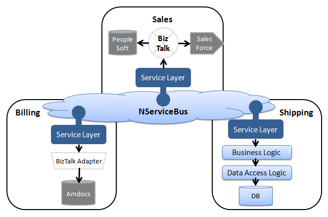

BizTalk is a centralized message broker with many adapters for third-party applications. Its primary use case is integration with existing systems and legacy applications, possibly running on different technologies and using proprietary protocols. This is a classical Enterprise Application Integration (EAI) situation and is not what service buses are meant to address.

In these cases, NServiceBus can be used in combination with BizTalk. NServiceBus would handle the communication between the high-level business services. BizTalk would be responsible for the integration with existing systems and legacy applications within the relevant services, without crossing the service boundary. 

When designing systems, keep in mind that mixing logical orchestration and routing with business logic, data access, and web services calls results in having slow, complex and unmaintainable code. Divide those responsibilities carefully. Note that when BizTalk is used within a service it is just an implementation detail that doesn't impact any other services. Keeping it within a service boundary avoids typical performance and maintainability problems.
