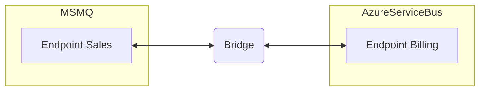

## Hosting

NServiceBus Messaging Bridge is hosted using the [.NET Generic Host](https://docs.microsoft.com/en-us/dotnet/core/extensions/generic-host) which takes care of life cycle management, configuration, logging, and other concerns.

snippet: generic-host

The overload that accepts a [`HostBuilderContext`](https://docs.microsoft.com/en-us/dotnet/api/microsoft.extensions.hosting.hostbuildercontext) provides access to the [`IConfiguration` type](https://docs.microsoft.com/en-us/dotnet/core/extensions/configuration) and other host related details.

snippet: generic-host-builder-context

## Registering endpoints

If a logical endpoint communicates with other endpoints that use a different transport, it must be registered with the bridge. Endpoints are registered with the bridge on the transport they run on. The bridge then creates a proxy endpoint on each transport that needs to be bridged.

snippet: endpoint-registration

> [!NOTE]
> Having the same logical endpoint running on both transports is not supported. The bridge will throw an exception if an endpoint is registered on more than one transport.
>
> If a duplicate endpoint it is not registered with the bridge, any messages it sends that need to be forwarded across the bridge will fail and get sent to the [bridge error queue](#recoverability-error-queue).

## Registering publishers

When NServiceBus discovers a message handler in an endpoint for an event, it automatically subscribes to this event on the transport. The publisher itself is not aware of this, since it does not receive a notification when a subscriber subscribes to an event. This represents a challenge for the bridge.

If an endpoint subscribes to an event, the bridge must be made aware of this subscription since it must register the same subscription on the transports it's bridging. As the bridge is unaware of any subscriptions, the bridge must be configured to mimic the behavior of the endpoints.

The result is duplicate subscriptions for any endpoint that subscribes to an event. The endpoint that publishes the event must be configured as well.

snippet: register-publisher

> [!WARNING]
> The endpoint name used when creating a `BridgeEndpoint` is case-sensitive, even if one or both transports don't require it. This is to accommodate all transports, some of which require a case-sensitive endpoint name. More details can be found on [this issue](https://github.com/Particular/NServiceBus.MessagingBridge/issues/175).

Legacy transport versions that use [message-driven pub/sub](/nservicebus/messaging/publish-subscribe/#mechanics-message-driven-persistence-based) require the fully qualified assembly type name value to be passed. Note that passing the culture and public key is not needed -- only the type name, assembly name, and assembly version are used in filtering subscribers by the message-driven pub/sub-feature.

snippet: register-publisher-legacy

> [!NOTE]
> Using the overloads that accept a type instead of a string value is recommended. Passing types can be problematic when not using [naming conventions for messages via unobtrusive mode](/nservicebus/messaging/conventions.md).

partial: multiple-publishers

### Referencing event types

When an assembly containing message types is referenced, either `typeof()` or a type argument may be used for type-safety when registering publishers. Sometimes it is not possible to reference an assembly containing message types. For example, the assembly may reference a different version of NServiceBus than the bridge. In these cases, the fully-qualified name of an event may be used instead. This may even be preferable to referencing message assemblies, to reduce the chance of compile-time conflicts.

## Provisioning queues

By default, the bridge does **not** create queues for the endpoints that it proxies. This is done so that elevated privileges (which are often needed to create the queues) are not required at runtime.

The queues can be created using one of the following methods:

- Provisioning them manually using the tooling provided by the queuing system.
- Using the queue creation tooling provided by Particular Software if one exists for the transports being used. See the [individual transports documentation](/transports/) for more details.
- Configuring the bridge to create queues of [proxied endpoints](/nservicebus/bridge/configuration.md#registering-endpoints) automatically as described in the next section.

### Automatic queue provisioning

> [!NOTE]
> This option requires the bridge to have administrative privileges for the queuing systems used and is not recommended for production scenarios.

Automatic queue creation for proxied endpoints is enabled by configuring the bridge as follows:

snippet: auto-create-queues

The diagram below shows a simple MSMQ-to-AzureServiceBus configuration involving two endpoints.

and the following bridge configuration

snippet: auto-create-queues-proxies

When automatic queue creation is enabled a "Sales" proxy endpoint is created on the AzureServiceBus transport and a "Billing" proxy endpoint is created on the MSMQ transport. These proxy endpoints represent the endpoint on the other side of the bridge.

| MSMQ | AutoCreated | AzureServiceBus | AutoCreated |
|---|---|---|---|
| Sales | _False_ | Sales | _True_ |
| Billing | _True_ | Billing | _False_ |

The "Sales" queue on the MSMQ transport and the "Billing" queue on the AzureServiceBus transport are assumed to be created by the endpoints connected on those transport and therefore are not owned by the bridge queue creation.

## Custom queue address

The bridge provides the ability to change the address of the queue of incoming messages.

> [!NOTE]
> When forwarding messages to MSMQ endpoints that run on different servers than the bridge, the addresses of the queues that messages should be forwarded to _must_ be provided.

snippet: custom-address

## Recoverability

If a message fails while it is being forwarded to the target transport, the following recoverability actions are taken:

1. Three immediate retries are performed to make sure that the problem isn't transient.
1. If the retries fail, the message is moved to the bridge error queue.

### Error queue

The error queue used by the bridge is named `bridge.error` by default. Note that the default `error` queue used by other platform components can not be used to enable bridging of the system-wide error queue since a bridged queue may not be used as the error queue. See the documentation around [bridging platform queues](#bridging-platform-queues) for more details.

A different error queue may be configured as follows:

snippet: custom-error-queue

Messages moved to the error queue have the [`NServiceBus.FailedQ`](/nservicebus/messaging/headers.md#error-forwarding-headers-nservicebus-failedq) header set to allow scripted retries. Refer to the documentation for the [various transports](/transports) for more details on how to perform retries.

## Auditing

The bridge add a `NServiceBus.Bridge.Transfer` header to a message while that message is transferred between transports.

The value of the header is `{source-transport-name}->{target-transport-name}`. For example: `msmq->sqlserver`. This header provides traceability for a message as it moves through the bridge.

### Configuring transports

By default, the bridge assigns a transport name based on the type of transport being used. This means that when bridging transports of the **same type**, each transport must be given a unique name. For example:

snippet: custom-transport-name

## Bridging platform queues

The bridge can be configured to allow a [single ServiceControl installation to manage and monitor endpoints on all bridged transports](/servicecontrol/servicecontrol-instances/remotes.md#overview-multi-transport-deployments). For example:

snippet: platform-bridging

> [!WARNING]
> The endpoint name used when creating a `BridgeEndpoint` is case-sensitive, even if one or both transports don't require it. This is to accommodate all transports, some of which require a case-sensitive endpoint name. More details can be found on [this issue](https://github.com/Particular/NServiceBus.MessagingBridge/issues/175).

partial: failed-messages

### Audit queue

Special considerations are required for the audit queue due to potentially high message volume. For example, a [dedicated ServiceControl audit instance](/servicecontrol/audit-instances/) could be created for each bridged transport, to make audit ingestion more efficient.

partial: monitoring

