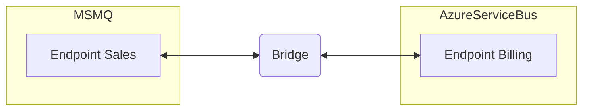

The NServiceBus Messaging Bridge allows NServiceBus endpoints to connect to other endpoints that are not using the same transport using the [Messaging Bridge Pattern](https://www.enterpriseintegrationpatterns.com/patterns/messaging/MessagingBridge.html).

The bridge is transparent to both sending and receiving endpoints. Endpoints are unaware that messages are being transferred across different transports. They send and receive messages to and from logical endpoints as if no bridge were involved.

> [!NOTE]
> The bridge package version is not tied to any specific version of NServiceBus. Therefore, the latest version of the Messaging Bridge package should be used, independent of the NServiceBus version used in any endpoints.

## Why use the bridge

The messaging bridge enables several scenarios:

- Migrating from one transport to another. E.g. migration from MSMQ to a cloud-native transport. The bridge allows endpoints to be migrated one at a time rather than all at once.
- Using multiple transports because of pricing considerations. Instead of relying only on a cloud-native transport (which may be more expensive), less mission critical endpoints could operating on a cheaper transport.
- Using a transport that best fits non-functional considerations. E.g. A transport that allows bridging geographical locations, while some endpoints on a more secure transport only process private information.

More details on these scenarios are provided in the [messaging bridge scenarios](scenarios.md) article.

## Hosting

While it's technically possible to co-host the bridge within the same process as a regular NServiceBus endpoint, it's generally recommended to run the bridge in a dedicated hosting process. The bridge's purpose is purely infrastructural—it connects logical endpoints. 

To fulfill this role as efficiently as possible, it may be necessary to scale the bridge either [vertically](performance.md#performance-tuning) or [horizontally](performance.md#scaling-out). Because of its infrastructural nature, the bridge also exhibits significantly different CPU, memory, and monitoring characteristics compared to a typical NServiceBus endpoint that handles business logic.

## Bridge configuration

partial: configuration

The diagram below shows a simple MSMQ-to-AzureServiceBus configuration involving two endpoints. The two transports are used for demonstration purposes. The bridge supports [all transports](/transports/).

The following code enables the Sales endpoint hosted on the MSMQ transport to communicate with the Billing endpoint hosted on the AzureServiceBus transport.

snippet: bridgeconfiguration

The life cycle of the bridge is managed by the .NET Generic Host.

## Errors

partial: errors

> [!NOTE]
> The messages in the `bridge.error` queue are not compatible with ServiceControl at this moment.

## Consistency

If the bridge moves messages across different transport types or different brokers of the same type (e.g. Azure ServiceBus namespaces, or RabbitMQ virtual hosts), [`ReceiveOnly`](/transports/transactions.md#transactions-transport-transaction-receive-only) is the only supported transaction mode. In this mode, messages that are moved across the bridge may be duplicated if some infrastructure-related issue prevents the message from being moved to the target transport. To address this either [ensure that handlers are idempotent or enable deduplication of messages using the outbox](/transports/transactions.md#transactions-transport-transaction-receive-only-consistency-guarantees).

The bridge uses this mode if at least one of the configured transports is unable to use distributed transactions.

### Distributed transactions

If all configured transports support the [`TransactionScope`](/transports/transactions.md#transactions-transaction-scope-distributed-transaction) transaction mode, the bridge uses that transaction mode so that no messages are duplicated during message transfer between transports. This enables migration from the MSMQ transport to the SQL Server transport without having to make changes to the endpoints.

If `ReceiveOnly` transaction mode is preferred, the following configuration may be used:

snippet: bridge-configuration-explicit-receive-only-mode
