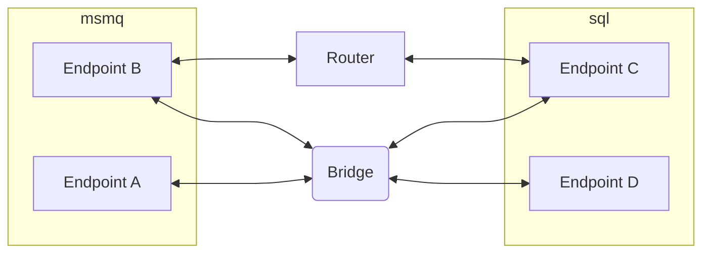

This is a migration guide for those that have been making use of the community package `NService.Router` and want to move to the fully supported `NServiceBus.Transport.Bridge` component.

## Router versus Bridge

The Bridge is fully supported compared to the Router, which is a community package. The Router works perfectly as well, but the fact that the Bridge is fully supported, could by itself  already be a reason to start a migration.

The Bridge also does not require what the Router calls 'connectors'. After migration, these connectors no longer need to be deployed with every endpoint. A more important result of this is that not a single endpoint is aware of the fact that transports are bridged by a different component. One of the many benefit of this is that [migration to a different transport](scenarios.md) becomes easier than ever before.

## Steps to migrate

To migrate the following has to be considered

- In-flight messages
- Commands
- Events
- Additional messages

#### In-flight messages

In-flight messages are messages that were send to an endpoint, but have not been processed yet. As the Router changes the routing for messages so that they are send directly the the Router component, this means that any in-flight messages will require the Router to be available to them. Even when endpoints have already been configured to no longer use the Router anymore.

For what time the Router needs to be kept running can depend on a lot of factors. If it is unclear what the right time is to remove the Router, contact [Particular Software](https://particular.net/contactus).

#### Commands

Commands are the easiest to migrate as they have a very specific route towards a specific logical endpoint. After the Bridge has been set up and running, every endpoint can remove any Router related configuration for routing commands using the connector. This implies that the original routing towards the specific endpoint can be restored and the Bridge will make sure it is transferred to the correct transport.

#### Events

Events are the hardest part for migrating from the Router to the Bridge.

The issue is with the subscriptions that are registered within a message broker. The scenario could exist as seen in the graph below, where `Endpoint B` publishes an event and the event is sent to both the `Router` and the `Bridge`. As a result, `Endpoint C` could receive the same event twice. Both events would have the same message identifier, which enables the [Outbox](/nservicebus/outbox/) to de-duplicate the messages. Without the Outbox, either the message handler needs to be [idempotent](/nservicebus/concepts/glossary.md#idempotence) or the event will be processed twice.

Take the following steps to move from Router to Bridge:

1. Take down both `EndpointB` and the `Bridge`.

1. Configure the `Bridge` to register a publisher with `Endpoint C` for the event that `Endpoint B` publishes.
2. Remove the subscription from the message broker for the Router.
3. Add the subscription to the message broker for the Bridge.
4. Start the `Bridge`.
5. Start `Endpoint B`.

When the `Bridge` starts up, it will also create the subscription and it is not required to manually create the subscription in the message broker. It is important however to be aware of when `Endpoint B` cannot be taken offline due to high availability, scaling out or service level agreements.

NOTE: If Endpoint B cannot be taken offline, the time between step 3 and step 4 determine how many events will be lost.

#### Additional messages

There are additional messages like request/response messages, which route a message back to the endpoint it originated from. These will all have to be routed back using the Router component. The result is that as long as there are messages like these to be processed, the Router component has to be active within your system.

## Conclusion

Migrating from the Router to the Bridge doesn't have to be extremely hard, but it is something that requires consideration, thought and some time before the Router component can be completely removed from a system.