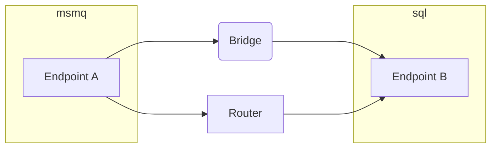

This is a guide for migrating from the `NService.Router` community package to Particular Software's `NServiceBus.Transport.Bridge` package.

## Router versus bridge

One important difference between `NServiceBus.Transport.Bridge` and `NServiceBus.Router` is that `NServiceBus.Transport.Bridge` is supported by Particular Software. `NServiceBus.Router` is a community package and is not supported by Particular Software.

The bridge does not require what the NServiceBus.Router calls _connectors_.

`NServiceBus.Router` has the concept of _connectors_ which it uses to configure endpoints so that messages are delivered to the correct destination. Connectors must be deployed alongside the endpoints they are routing. The bridge does not require connectors or any other similar component. Endpoints are not aware that a bridge is translating messages between transports so after migrating to the bridge, these connectors no longer need to be deployed with each endpoint. One of the benefits of this is that [migration to a different transport](scenarios.md) is easier with `NServiceBus.Transport.Bridge` than with `NServiceBus.Router`.

## Steps to migrate

The following types of messages must be taken into consideration for migration:

- In-flight messages
- Commands
- Events
- Additional messages

### In-flight messages

In-flight messages are messages that were sent to an endpoint but have not been processed yet. That is, a message may have been sent using `NServiceBus.Router` but after migration, it may be processed by the messaging bridge. Since `NServiceBus.Router` changes the routing for messages so that they are sent directly to the `Router` component, this means that any in-flight messages will require the `Router` component to be available, even when endpoints have already been configured to no longer use `NServiceBus.Router`.

Because of this, `NServiceBus.Router` must remain running until all in-flight messages have been delivered. The time this takes is specific to each system. If it is unclear what the right time is to stop the NServiceBus.Router, contact [Particular Software](https://particular.net/contactus) for guidance.

#### Commands

Commands are the easiest to migrate as they have a specific route to a specific logical endpoint. As soon as `NServiceBus.Transport.Bridge` is introduced, all `NServiceBus.Router`-related configuration for routing commands using the connector can be removed from every endpoint. This implies that the original routing towards the specific endpoint can be restored and the bridge will make sure it is transferred to the correct transport.

#### Events

Events require more effort to migrate from `NServiceBus.Router` to `NServiceBus.Transport.Bridge` due to subscriptions that are registered within a message broker.

A scenario could exist as shown in the graph below, where `Endpoint A` publishes an event and the event is sent to both the `NServiceBus.Router` and the `NServiceBus.Transport.Bridge`. As a result, `Endpoint B` could receive the same event twice.

Note that both events would have the same message identifier, which allows the [outbox](/nservicebus/outbox/) to de-duplicate the messages. Without the outbox, either the message handler must be [idempotent](/nservicebus/concepts/glossary.md#idempotence) or the event will be processed twice.

In this scenario, the following steps may be taken to migrate from `NServiceBus.Router` to `NServiceBus.Transport.Bridge`:

1. Stop both `Endpoint A` and the `Bridge`.
2. Configure the `Bridge` to register a publisher with `Endpoint B` for the event that `Endpoint A` publishes.
3. Remove the subscription from the message broker for the `Router`.
4. Add the subscription to the message broker for the `Bridge`.
5. Start the `Bridge`.
6. Start `Endpoint A`.

When the `Bridge` starts up, it will also create the subscription; it is not required to manually create the subscription in the message broker. However, be aware of when `Endpoint A` cannot be taken offline due to high availability, scaling out or service level agreements.

NOTE: If Endpoint A cannot be taken offline, the time between step 3 and step 4 determines how many events will be lost.

#### Additional messages

There may be additional messages, like request/response messages, which route a message back to the endpoint it originated from. These must be routed back using the `NServiceBus.Router` component. The result is that as long as there are messages like these to be processed, the `NServiceBus.Router` component must be active within the system alongside the bridge.

## Conclusion

Migrating from `NServiceBus.Router` to `NServiceBus.Transport.Bridge` is not difficult, but it requires careful consideration and analysis before `NServiceBus.Router` can be completely removed from a system.
