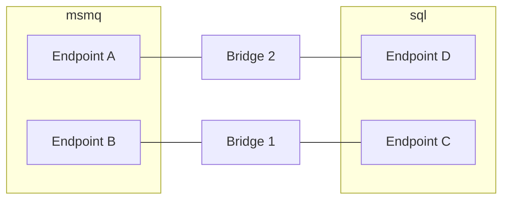

This is a guide to performance considerations when using the NServiceBus Messaging Bridge and how to scale out. There are several reasons to scale out, such as achieving higher message throughput, or providing high availability.

## Performance tuning

The bridge moves messages using [the same default concurrency as NServiceBus endpoints](/nservicebus/operations/tuning.md#configuring-concurrency-limit) which is `max(Number of logical processors, 2)`.

The concurrency level may be changed:

snippet: custom-concurrency

## Scaling out

The performance of regular endpoints is impacted by many factors, including databases containing business data and third party services like SMTP servers or a web services. In contrast, the performance of the bridge is affected mainly by resources like CPU, network, and disk. This makes it easier to decide when to scale out the bridge.

### Competing consumers

As with [regular NServiceBus endpoints](/nservicebus/architecture/scaling.md#scaling-out-to-multiple-nodes-competing-consumers), the easiest way to scale out is with [brokered transports](/transports/types.md#broker-transports), as those can make use of the *[competing consumer pattern](https://www.enterpriseintegrationpatterns.com/patterns/messaging/CompetingConsumers.html)*. This is done by deploying multiple instances of the bridge, all with the same configuration, allowing any instance to process any message in the queue.

The bridge accesses messages using NServiceBus transport packages, which ensure that only one instance processes a given message.

NOTE: MSMQ is not a brokered transport and cannot benefit from the competing consumer pattern.

### Splitting up the bridge

It is possible to use multiple logical instances of the bridge. Each logical instance may be configured to mimic only specific endpoints. In the diagram below, one bridge mimics only endpoints B and C, and the other mimics endpoints A and D. The result (which is not visible in the diagram) is that endpoint B can still send messages to endpoint D, but those are processed by bridge 2. When endpoint A sends a message to endpoint C, those messages are processed by bridge 1.

This can be useful when resources such as a CPU and disk are fully utilized and the competing consumers pattern isn't an appropriate solution.

NOTE: It may be useful to split up logical endpoints to increase throughput for *specific messages*. For the bridge, this benefit is lost, as each endpoint that is mimicked by the bridge has its own message processing pipeline, separate from other mimicked endpoints.

