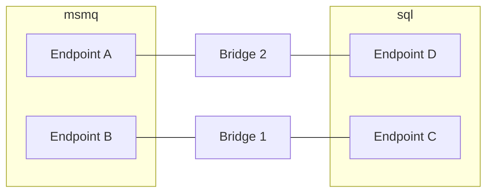

This guide outlines performance considerations when using the NServiceBus Messaging Bridge and provides guidance on how to scale out effectively. There are several reasons to scale out, such as increasing message throughput or ensuring high availability.

## Performance tuning

The bridge moves messages using [the same default concurrency as NServiceBus endpoints](/nservicebus/operations/tuning.md#configuring-concurrency-limit) which is calculated as `max(Number of logical processors, 2)`.

You can modify the concurrency level as needed to better suit your performance requirements.

snippet: custom-concurrency

## Scaling out

The performance of regular endpoints is impacted by many factors, including databases containing business data and third party services like SMTP servers or web services. In contrast, the performance of the bridge is affected mainly by infrastructure resources like CPU, network, and disk. This makes it easier to determine when and how to scale out the bridge.

### Competing consumers

As with [regular NServiceBus endpoints](/nservicebus/scaling.md#scaling-out-to-multiple-nodes-competing-consumers), the easiest way to scale out is by using [brokered transports](/transports/types.md#broker-transports), as those can make use of the *[competing consumer pattern](https://www.enterpriseintegrationpatterns.com/patterns/messaging/CompetingConsumers.html)*. This is done by deploying multiple instances of the bridge, all with the same configuration, allowing any instance to process any message in the queue.

The bridge accesses messages using NServiceBus transport packages. These packages ensure that each message is processed by only one instance.

> [!NOTE]
> MSMQ is not a brokered transport and cannot benefit from the competing consumer pattern.

### Splitting up the bridge

It is possible to use multiple logical instances of the bridge. Each logical instance may be configured to mimic only specific endpoints. In the diagram below, one bridge mimics only endpoints B and C, and the other mimics endpoints A and D. Although not shown in the diagram, this setup still allows full message routing. Endpoint B can still send messages to endpoint D, but those are processed by bridge 2. Similarly, when endpoint A sends a message to endpoint C, those messages are processed by bridge 1.

This approach can be useful when system resources such as CPU and disk are fully utilized, and the competing consumers pattern is not a suitable solution.

> [!NOTE]
> Splitting logical endpoints can improve throughput for *specific messages*. However, with the bridge, this benefit is lost, as each endpoint that is mimicked by the bridge has its own message processing pipeline, separate from other mimicked endpoints. As a result, there’s no shared throughput benefit between mimicked endpoints.

