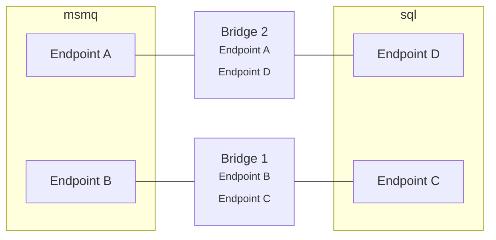

This page describes performance considerations when using the `NServiceBus.Transport.Bridge` component and how to scale out. There are several reasons to scale out, such as to achieve higher message throughput, or to provide high availability.

## Performance tuning

The bridge moves messages using [the same default concurrency as NServiceBus endpoints](/nservicebus/operations/tuning.md#configuring-concurrency-limit) which is `max(Number of logical processors, 2)`.

Customizing the concurrency level can be done using the following configuration:

snippet: custom-concurrency

## Scaling out

The performance of regular endpoints can be impacted by databases containing business data or third party services like an SMTP server, which results in considering many facets when optimizing for performance. Whereas the performance of the bridge is mainly impacted by resources like CPU, network and disk. This makes it an easier decision to scale out the Bridge.

### Competing consumers

As with [regular NServiceBus endpoints](/nservicebus/architecture/scaling.md#scaling-out-to-multiple-nodes-competing-consumers), the easiest way to scale out is with [brokered transports](/transports/types.md#broker-transports), as those can make use of the *[competing consumer pattern](https://www.enterpriseintegrationpatterns.com/patterns/messaging/CompetingConsumers.html)*. This is done by deploying multiple instances of the Bridge, all with the same configuration. Every instance will start processing messages from the same queue. When a message needs to be processed by the Bridge, any of the instances could potentially process it.

The Bridge accesses messages using actual NServiceBus transport packages. Each transport on its own will try to ensure that only one instance will actually process the message.

NOTE: MSMQ is not a brokered transport and cannot benefit from competing consumer pattern.

### Splitting up the Bridge

It is possible to use different logical instances of the Bridge. Each logical instance can be configured so that they mimic only certain endpoints. In the diagram below, one Bridge only takes care of Endpoint B and Endpoint C, while the other takes care of Endpoint A and Endpoint D. The result (which is not visible in the diagram) is that Endpoint B can still send messages to Endpoint D, but those will be processed by Bridge 2. When Endpoint A sends a message to Endpoint C, those messages will be processed by Bridge 1.

This can be a benefit when resources such as a CPU or disk are fully utilized and the competing consumers pattern isn't the required solution.

NOTE: It can be a best practice for logical endpoints to be split up to increase throughput for *specific messages*. For the Bridge this benefit is lost, as each endpoint that is mimicked by the Bridge, has its own message processing pipeline, separated from other mimicked endpoints.

