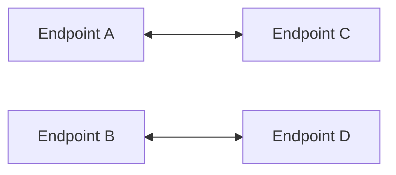
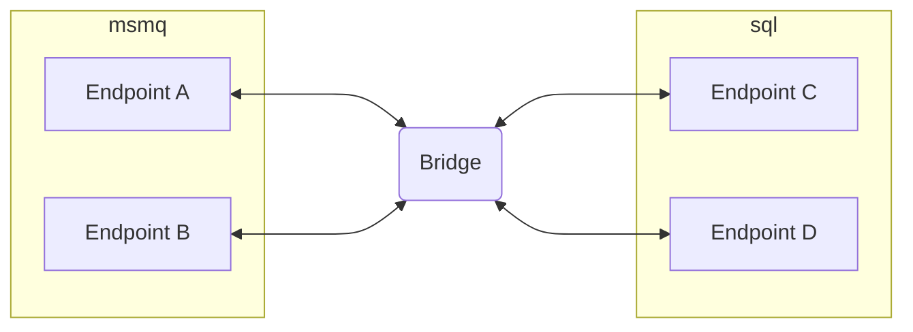

Several scenarios can be achieved when using the `NServiceBus.Transport.Bridge` component, including:

- Migrating a system from one transport to another transport
- Using different transports in a microservices environment where each service uses the transport that provides the most benefit for it
- Using multiple instances of the same transport, differentiated by some distinguishing factor (e.g. Azure Service Bus namespaces, or SQL Server database instances)

## Migrate to a different transport

Migrating from one transport to another can be a complex task. In-flight messages (i.e. ones that have been sent but not yet processed) must be accounted for at all times. Some common examples of in-flight messages:

- In a queue, waiting to be processed by an instance of the logical endpoint
- In the error queue, waiting to be retried (or picked up by ServiceControl)
- In ServiceControl, waiting to be retried

When a plan is created to move or sunset an endpoint, re-configuring the routing for any endpoint is straightforward and NServiceBus takes care of new messages sent after the endpoint is re-deployed on the new transport. However in-flight messages must be carefully considered and action must be taken to ensure these messages arrive at the correct destination, which is not always the place where these messages were originally sent to.

Take the scenario where a system migrates from the MSMQ transport to the SQL Server transport. Converting the endpoints to use SQL Server all at once would be difficult, as all in-flight messages would be stuck in MSMQ. Instead, the NServiceBus transport bridge can provide a way to migrate these endpoints one-by-one.

### Initial situation

Taking a sample migration scenario, assume there are four endpoints that can communicate with each other via messaging. Each endpoint can communicate with the others, but for simplicity the number of arrows between them are reduced.

### Initiating the migration

To slowly migrate endpoints to the other transport and to prevent moving all endpoints at once, the migration will start with two endpoints and move them to the SQL Server transport.

In this scenario, a new endpoint is introduced which will act as the bridge. The bridge is configured with two instances of `BridgeTransport`, one for MSMQ and one for SQL Server. The MSMQ `BridgeTransport` is configured to have `EndpointA` and `EndpointB` and the SQL Server `BridgeTransport` is configured to have `EndpointC` and `EndpointD`. If any events are involved, the publishers for those [must be configured](/nservicebus/bridge/configuration.md#registering-publishers).

### Finishing the migration

Eventually the last endpoints can be moved over. It is then possible to configure the bridge to have all endpoints on the SQL Server transport, so the in-flight messages that are retried and returned to their logical endpoint, end up at the bridge and are moved over to the SQL Server transport by the bridge.

## Multiple transports

Every transport has [pros and cons](/transports/selecting.md). Some transports have higher throughput, others have higher reliability and consistency. Sometimes some messages are better handled in the cloud where hosting is taken care off by the cloud provider, but other messages must be on-premise and not leave the network.

Each endpoint of a distributed system should be free to choose the transport that best suits its needs. In fact, this is encouraged in a microservices architecture. The `NServiceBus.Transport.Bridge` can be used to set up endpoints on different transports, just like in the migration scenario above. Except in this scenario, there is no migration; the different transports might remain in place for the life of the system. This is a perfectly viable scenario and easily achieved using the bridge.

### Particular Platform

In a multiple transport scenario, it is likely that error and audit messages need to be collected by a single ServiceControl instance, rather than separate instances for each transport. It is possible to bridge the information that is directed at ServiceControl via the bridge.

The [configuration documentation](/nservicebus/bridge/configuration.md) describes how this can be achieved.

## Multiple instances of a transport

Another possible scenario is where there are multiple instances of the same transport. As with [multiple transports](#multiple-transports), this is a scenario which could remain in place for the life of the system.

An example of this scenario is using different namespaces in Azure Service Bus, or different SQL Server database instances, or even different SQL Server instances.

The [bridge sample](/samples/bridge/simple) shows how this is achieved by using the LearningTransport on each side of the bridge. The second instance of the LearningTransport is stored in a different location than the first instance. This simulates endpoints that cannot communicate with each other directly and need the `NServiceBus.Transport.Bridge` to bridge the two instances of the LearningTransport.
