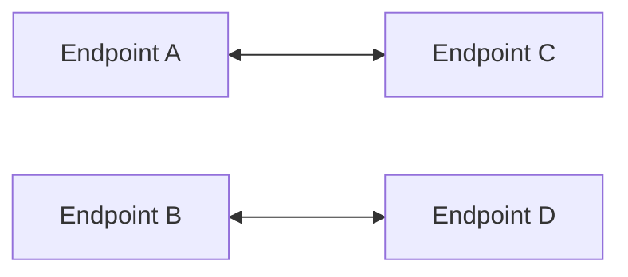
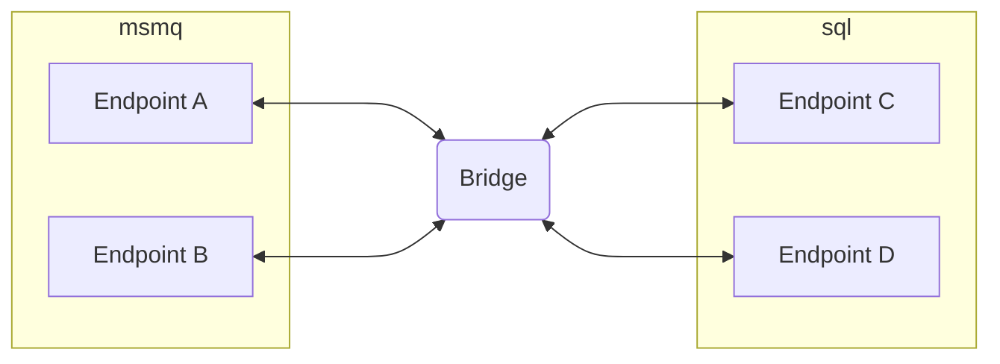

The NServiceBus Messaging Bridge supports several key scenarios, including:

- Migrating a system from one transport to another transport
- Using different transports in a microservices architecture, allowing each service to choose the most suitable transport
- Connecting multiple instances of the same transport, such as different Azure Service Bus namespaces or separate SQL Server database instances

## Migrate to a different transport

Migrating from one transport to another can be a complex task. In-flight messages (i.e. ones that have been sent but not yet processed) must be accounted for at all times. Some common examples of in-flight messages:

- Messages in a queue, waiting to be processed by an instance of the logical endpoint
- Messages in the error queue, waiting to be retried (or picked up by ServiceControl)
- Messages in ServiceControl, waiting to be retried

When planning to move an endpoint, NServiceBus automatically handles new messages sent after the endpoint is redeployed on the new transport. However in-flight messages must be carefully considered to ensure these messages arrive at the correct destination, which is not always the place where these messages were originally sent.

For example, consider a system migrating from the MSMQ transport to SQL Server. Migrating all endpoints at once is risky, as in-flight messages would remain stuck in MSMQ. Instead, the NServiceBus Messaging Bridge allows endpoints to be migrated incrementally, enabling safe and controlled transitions between transports.

### Initial situation

Consider a sample migration scenario system with four endpoints that communicate with each other via messaging.  Initially, all four endpoints use the MSMQ transport. Each endpoint can communicate with the others, but for simplicity the number of arrows between them are reduced.

### Initiating the migration

To slowly migrate endpoints to the other transport (in this case, SQL Server) and to prevent moving all endpoints at once, the migration will start with two endpoints and move them to the SQL Server transport.

In this scenario, a new endpoint is introduced which will act as the bridge. The bridge is configured with two instances of `BridgeTransport`, one for MSMQ and one for SQL Server. The MSMQ `BridgeTransport` is configured to have `EndpointA` and `EndpointB` and the SQL Server `BridgeTransport` is configured to have `EndpointC` and `EndpointD`. If any events are involved, the publishers for those [must be configured](/nservicebus/bridge/configuration.md#registering-publishers) to ensure proper message routing.

### Finishing the migration

Once all endpoints are migrated, the bridge can be updated to include only SQL Server transports. This setup ensures that any in-flight messages retried by ServiceControl are routed through the bridge and delivered to their intended destination on the new SQL Server transport.

## Multiple transports

Every transport has [pros and cons](/transports/selecting.md). Some offer higher throughput, while others prioritize reliability or consistency. In many cases, certain messages are better handled in the cloud, where hosting is managed by a provider. Other messages, however, may need to remain on-premises for security or compliance reasons.

In a distributed or microservices-based system, each endpoint should be free to choose the transport that best meets its specific requirements. This approach is not only valid—it is encouraged. The NServiceBus Messaging Bridge allows endpoints on different transports to communicate seamlessly. Unlike migration scenarios, these transports may remain in place permanently, making this a stable and supported pattern.

### Particular Platform

In a multiple transport scenario, error and audit messages often need to be collected by a single ServiceControl instance, rather than separate instances per transport. The NServiceBus Messaging Bridge can be used to route these messages to a central ServiceControl instance across different transports.

The [configuration documentation](/nservicebus/bridge/configuration.md) describes how this can be achieved.

## Multiple instances of a transport

Another possible scenario is where there are multiple instances of the same transport. As with [multiple transports](#multiple-transports), this is a scenario which could remain in place for the life of the system.

An example of this scenario is using different namespaces in Azure Service Bus, or different SQL Server database instances, or even different SQL Server instances.

The [bridge sample](/samples/bridge/simple) shows how this is achieved by using the LearningTransport on each side of the bridge. The second instance of the LearningTransport is stored in a different location than the first instance. This simulates endpoints that cannot communicate with each other directly and need the NServiceBus Messaging Bridge to bridge the two instances of the LearningTransport.
