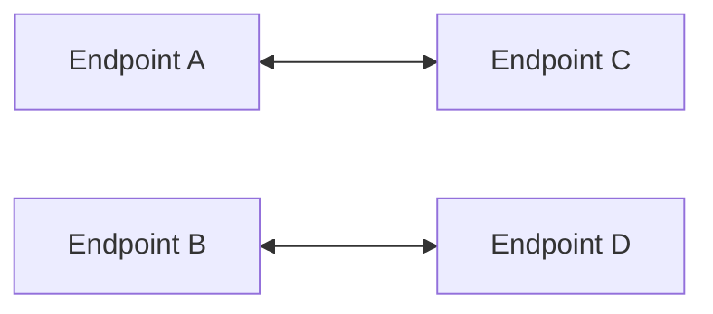
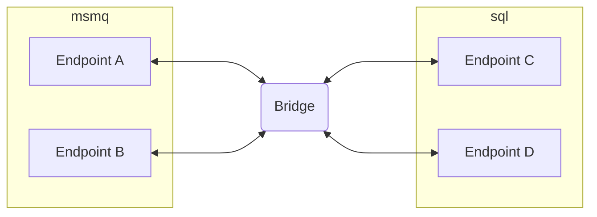

Several scenarios can be achieved when using the `NServiceBus.Transport.Bridge` component.

## Migrate to a different transport

Migrating from one transport to another can be a complex task. At all times the in-flight messages have to be taken into consideration. Those are messages that were send to an endpoint, but have not been processed yet:

- In a queue, waiting to be processed by an instance of the logical endpoint
- In the error queue, waiting to be retried (or picked up by ServiceControl)
- In ServiceControl, waiting to be retried

When a plan is created to move or sunset an endpoint, the easy part is to re-configure the routing for any endpoint and NServiceBus will take care of newly send messages. However in-flight messages need to be carefully considered and action must be taken to ensure these messages arrive at the correct destination, which is not always the place where these messages were originally sent to. 

In our scenario, that is because an endpoint is migrated from MSMQ transport to SQL Server transport. Moving all endpoints at once would be impossible, as all in-flight messages would be stuck on the MSMQ side. This is exactly what was taken into consideration when creating the `NServiceBus.Transport.Bridge`.

### Initial situation

Before starting the migration, there are four endpoints that can communicate with each other via messaging. Each endpoint can communicate with the others, but for simplicity the number of arrows between them are reduced.

### Initiating the migration

To slowly migrate endpoints to the other transport and to prevent moving all endpoints at once, we'll start with two endpoints and move those over to the SQL Server transport.

In this scenario a new endpoint is introduced which will act as the bridge. The bridge is then configured with two instances of `BridgeTransport`, one for MSMQ and one for SQL Server. The MSMQ `BridgeTransport` is configured to have `EndpointA` and `EndpointB` and the SQL Server `BridgeTransport` is configured to have `EndpointC` and `EndpointD`. If any events are involved, the publishers for those [need configuration](/nservicebus/bridge/configuration.md#registering-publishers).

### Finishing the migration

Eventually the last endpoints can be moved over. It is then possible to configure the bridge to have all endpoints on the SQL Server transport, so the in-flight messages that are retried and returned to their logical endpoint, end up at the bridge and are moved over to the SQL Server transport by the bridge.

## Multiple transports

Every transport has its pros and cons as can be read in the [transport selection guidance](/transports/selecting.md). Some transports have higher throughput, others have higher reliability and consistency. Sometimes some messages are better handled in the cloud where hosting is taken care off by the cloud provider, but other messages have to be on-premise and not leave the network.

In those occasions the `NServiceBus.Transport.Bridge` can be used to set up endpoints on different transports, just like in the migration scenario above. Except in this scenario, there is no migration; the different transports might even remain forever. This is a perfectly viable scenario and easily achieved using the bridge.

### Particular Platform

In this scenario however it is likely that error- and audit messages need to be collected by a single ServiceControl instance. And not in separate instances separated by the two transports. In this occasion it is possible to also bridge the information that is directed at ServiceControl via the bridge.

How this needs to be configured can be read in [configuration documentation](/nservicebus/bridge/configuration.md).

## Multiple instances of a transport

Another scenario that is possible is that where there are multiple instances of the same transport. Just like with the [multiple transports]() scenario in this guide, this is a scenario which could remain forever.

An example of such a solution is using different namespaces in Azure Service Bus, or different SQL Server database instances or even different SQL Server instances.

The [Bridge sample](/samples/bridge/simple) shows how this is achieved by using the LearningTransport twice. Except that the second instance of the LearningTransport is stored in a different location than the first instance. This literally results in that those endpoints cannot communicate with each other and need the `NServiceBus.Transport.Bridge` to bridge those two instances of the LearningTransport.