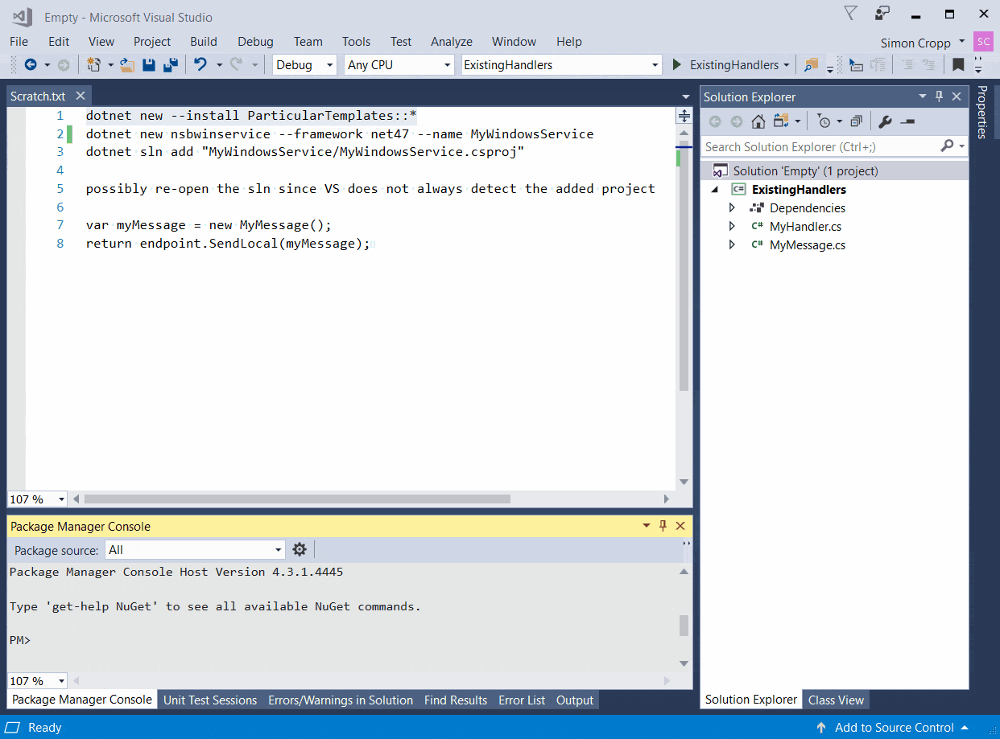

The Particular [dotnet new](https://docs.microsoft.com/dotnet/core/tools/dotnet-new) templates makes it easier to bootstrap a variety of common project and code related scenarios.


## Installation

Install using the following command:

snippet: install


## NServiceBus Endpoint Windows Service

This template makes it easier to create a [Windows Service](https://docs.microsoft.com/en-us/dotnet/framework/windows-services/introduction-to-windows-service-applications) host for NServiceBus. The template follows the approach outlined in [Windows Service Hosting](/nservicebus/hosting/windows-service.md).



The template can be used via the following.

snippet: nsbservice-usage

This will create a new directory named `MyWindowsService` containing a Windows Service `.csproj` also named `MyWindowsService`.

To add to an existing solution:

snippet: nsbservice-addToSolution


### Options

snippet: nsbservice-options


#### Target Framework

The target framework for the project.

`-f|--framework`

Default: `net462`

Supported: `net47`, `net462`, `net452`


## ServiceControl Transport Adapter

This template makes it easier to create a [Windows Service](https://docs.microsoft.com/en-us/dotnet/framework/windows-services/introduction-to-windows-service-applications) host for the [ServiceControl Transport Adapter](/servicecontrol/transport-adapter/).

The template can be used via the following.

snippet: scadapterservice-usage

This will create a new directory named `MyAdapter` containing a windows service `.csproj` also named `MyAdapter`.

To add to an existing solution:

snippet: scadapterservice-addToSolution


### Options

snippet: scadapterservice-options


#### Target Framework

The target framework for the project.

`-f|--framework`

Default: `net462`

Supported: `net47`, `net462`, `net452`


partial: dockerendpoint


## dotnet new information

> Creates a new project, configuration file, or solution based on the specified template. The dotnet new command provides a convenient way to initialize a valid .NET Core project. The command calls the template engine to create the artifacts on disk based on the specified template and options.

From [dotnet-new documentation](https://docs.microsoft.com/dotnet/core/tools/dotnet-new)


### Command execution

The `dotnet` command line operations can be executed from within any Console and the [Visual Studio 2017 Developer Command Prompt](https://docs.microsoft.com/dotnet/framework/tools/developer-command-prompt-for-vs).


### Reference material

 * [dotnet command documentation](https://docs.microsoft.com/dotnet/core/tools/dotnet)
 * [dotnet-new documentation](https://docs.microsoft.com/dotnet/core/tools/dotnet-new)
 * [dotnet-new options](https://docs.microsoft.com/dotnet/core/tools/dotnet-new?tabs=netcore2x#options)
 * [Template spec](https://github.com/dotnet/templating/wiki/%22Runnable-Project%22-Templates)
 * [How to create templates](https://blogs.msdn.microsoft.com/dotnet/2017/04/02/how-to-create-your-own-templates-for-dotnet-new/)


### List installed templates

To list the currently installed templates run [`dotnet new`](https://docs.microsoft.com/dotnet/core/tools/dotnet-new) with no parameters


### Template install

Where `[TemplatePackageName]` is the name of the NuGet package that contains the template and `[Version]` is a NuGet version number.

```ps
dotnet new --install [TemplatePackageName]::[Version]
```

The wildcard `*` can be used to target the current released version.

```ps
dotnet new --install [TemplatePackageName]::*
```


### Template Reset

To reset the installed templates to default list use:

```ps
dotnet new --debug:reinit
```


### Install Location

The downloaded NuGet packages are cached on on disk at:

```
%USERPROFILE%\.templateengine\dotnetcli\vDOTNETVERSION\packages
```

With the list of installed templates listed in:

```
%USERPROFILE%\.templateengine\dotnetcli\vDOTNETVERSION\settings.json
```


### Template uninstall

```ps
dotnet new --uninstall:[TemplatePackageName]
```
