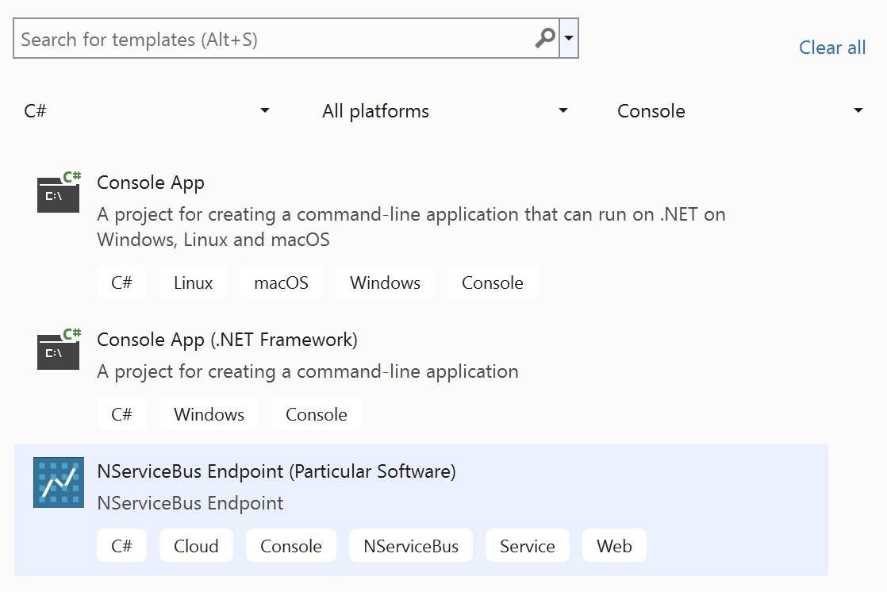
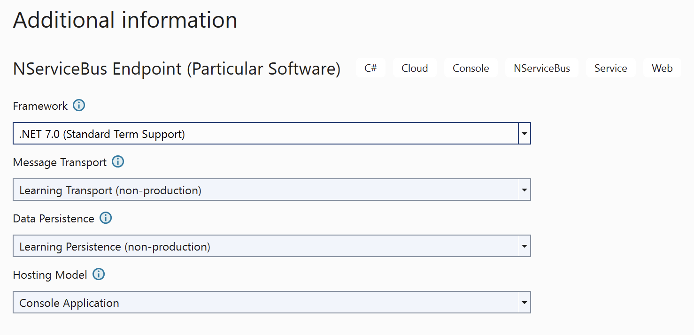

## NServiceBus Endpoint

The `nsbendpoint` template creates a C# project for an NServiceBus endpoint. By selecting options, the endpoint is preconfigured with choices of:

*  Target framework
*  [Message transport](/transports/)
*  [Persistence](/persistence/)
*  [Hosting model](/nservicebus/hosting/), which can be one of:
   * Console Application
   * [Windows service hosting](/nservicebus/hosting/#self-hosting-windows-service-hosting)
   * [Docker container hosing](/nservicebus/hosting/docker-host)

Once the package is installed, the template can be found in the Visual Studio **New Project** dialog:

After naming the project and selecting a location for it on disk, the **Additional information** screen will allow customizing the template:

### Command-line usage

The default usage will create a Console Application using [Learning Transport](/transports/learning), [Learning Persistence](/persistence/learning):

snippet: endpointdefault

Parameters allow the selection of message transport, persistence, and hosting model, including [Windows Service](/nservicebus/hosting/#self-hosting-windows-service-hosting) or [Docker container](/nservicebus/hosting/docker-host/) hosting.

### Options

| Option | Description |
|-|-|
| `-n`, `--name` | The name of the endpoint to create. |
| `-f`, `--framework` | The target framework for the project. One of: `net8.0`, `net7.0` (default), `net6.0`, `net48`, `net472` |
| `-t`, `--transport` | The message queue (transport) to use. One of `LearningTransport` (default), `AzureServiceBus`, `AzureStorageQueues`, `SQS`, `RabbitMQ`, `SQL`. |
| `-p`, `--persistence` | Where to store data. This should be the same place business data is stored. One of `LearningPersistence` (default), `MSSQL`, `MySQL`, `PostgreSQL`, `Oracle`, `CosmosDB`, `AzureTable`, `RavenDB`, `MongoDB`, `DynamoDB` |
| `-hm`, `--hosting` | The hosting model to use. One of: `ConsoleApp` (default), `WindowsService`, `Docker`|

For more details on available options and choices, use this command to get help:

snippet: endpointhelp
