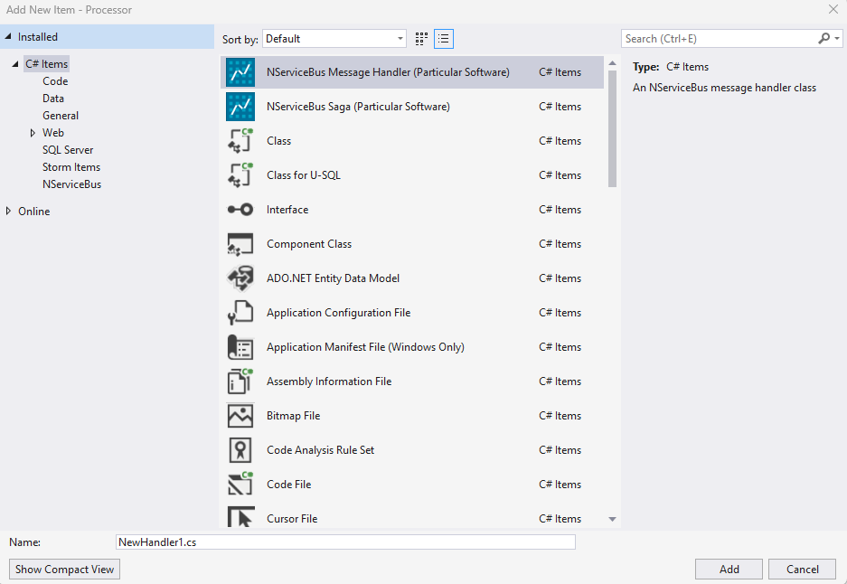

## NServiceBus Handler

The `nsbhandler` item template creates a C# class for a message handler.

Message handlers can be created using the Visual Studio New Item dialogue or the command line.

To create a message handler class that implements `IHandleMessages<MyMessage>`:

snippet: handlerdefault

### Options

| Option | Description |
|-|-|
| `-n`, `--name` | The name of the message handler class to create. |
| `-mt`, `--messagetype` | The message type for the handler to implement. Default: `MessageType` |

For more details on available options and choices, use this command to get help:

snippet: handlerhelp
