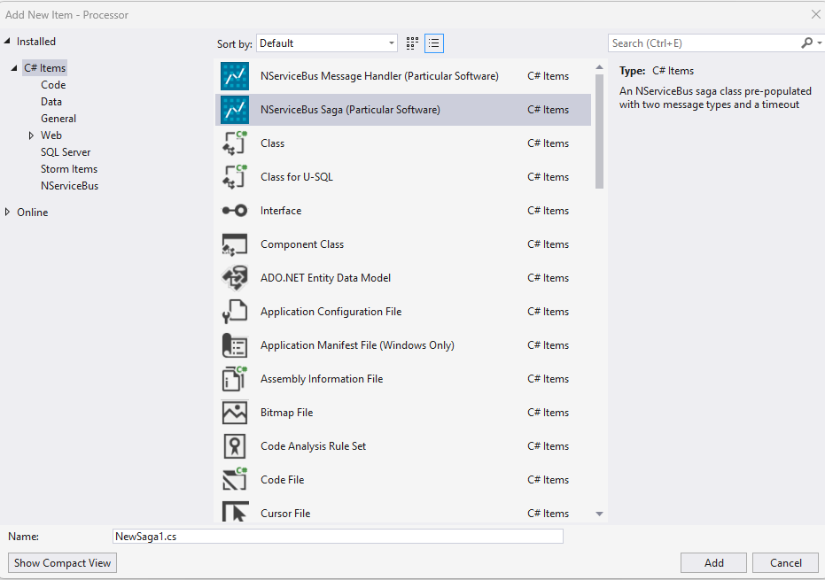

## NServiceBus Saga

The `nsbsaga` item template creates a C# class for a saga that includes the saga class, saga data class, handlers for two message types, a custom timeout class, and the `ConfigureHowToFindSaga` method.

Message handlers can be created using the Visual Studio New Item dialogue or the command line.

To create a saga:

snippet: sagadefault

### Options

| Option | Description |
|-|-|
| `-n`, `--name` | The name of the saga class to create. |
| `-mt2`, `--messagetype` | The first message type that will be handled by the saga. Default: `MessageType1` |
| `-mt1`, `--messagetype` | The second message type that will be handled by the saga. Default: `MessageType2` |

For more details on available options and choices, use this command to get help:

snippet: sagahelp
