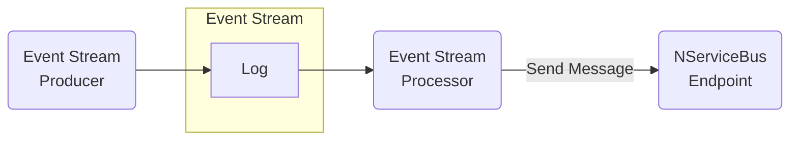

_Event stream processing_ is an architectural style in which a continuous stream of events serve as the basis to take further action in a system.

There are great tools that facilitate event streaming including:

- [Apache Kafka](https://kafka.apache.org/)
- [Azure Event Hubs](https://azure.microsoft.com/en-us/services/event-hubs/)
- [Amazon Kinesis](https://aws.amazon.com/kinesis/).

Although these tools and the Particular Service Platform both use the term _event_, [an event stream is not a queue](https://particular.net/blog/lets-talk-about-kafka).

Event streaming tools are great for situations where a large amount of data needs to be processed, looking for patterns or changes in state. Individual events are not meaningful, but meaningful insights can be extracted by processing many.

When something interesting is detected, that is a business event, and _it is time to use a message queue_. Message queues excel at handling business events, where each individual event is meaningful and important. Business events should be successfully processed once, and only once, and should be retried until they are successfully processed.

To facilitate this, message stream processors that detect interesting patterns can turn them into NServiceBus messages and events.

An example of this can be seen in the [Using NServiceBus and Kafka in Azure Functions sample](/samples/azure-functions/service-bus-kafka/).
