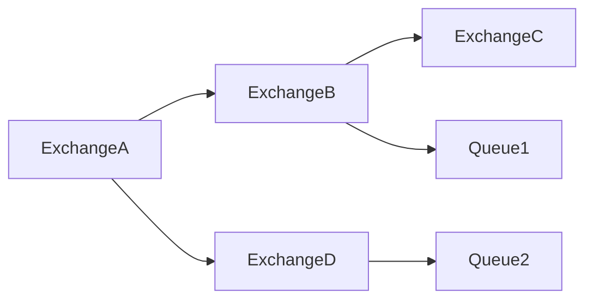

```
                 +-------------+
                 |            E|
                 | ExchangeA   |
                 |             |
                 +--+-------+--+
                    |       |
                    |       |
                    |       |
                    v       v

        +-------------+   +-------------+
        |            E|   |            E|
        | ExchangeB   |   | ExchangeD   |
        |             |   |             |
        +--+-------+--+   +----------+--+
           |       |                 |
           |       |                 |
           |       |                 |
           v       v                 v

+-------------+   +-------------+   +-------------+
|            E|   |            Q|   |            Q|
| ExchangeC   |   | Queue1      |   | Queue2      |
|             |   |             |   |             |
+-------------+   +-------------+   +-------------+

```